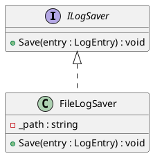
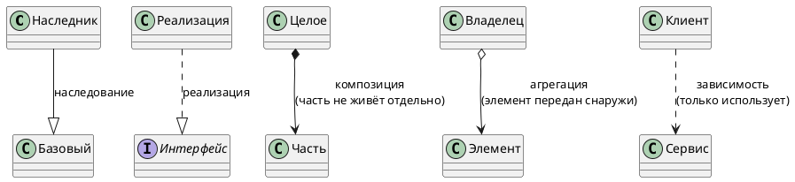
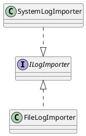
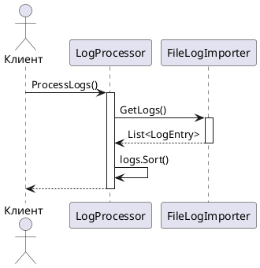
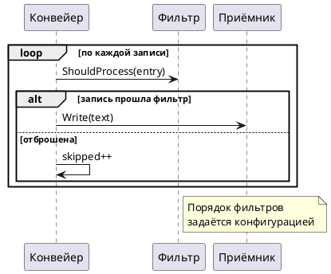
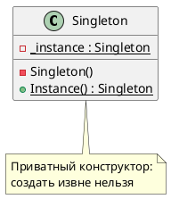
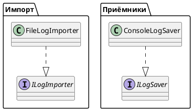

# Диаграммы на PlantUML

Краткое руководство. Во всех отчётах по лабораторным работам диаграммы
принимаются только в этом формате: исходник лежит в репозитории, его видно
в Pull Request, к нему можно оставить комментарий и его можно поправить.
Скриншот из редактора ничего из этого не позволяет.

Здесь собран тот минимум, которого хватает на все пять работ.
Под каждым примером — исходник и то, что из него получается.

---

## Как посмотреть результат

| Где | Как |
|---|---|
| VS Code | Расширение **PlantUML**, затем `Alt+D` — предпросмотр рядом с кодом |
| Rider, IntelliJ | Плагин **PlantUML Integration** |
| Без установки | Вставить исходник на <https://www.plantuml.com/plantuml/uml/> |
| Из командной строки | `java -jar plantuml.jar -tsvg -charset UTF-8 диаграмма.puml` |

В отчёте диаграмма записывается блоком кода с пометкой `plantuml` —
именно так её найдут проверяющий и сборщик PDF.

---

## Диаграмма классов

Минимальный набор: классы, интерфейсы, поля, методы.



Обозначения видимости: `+` public, `-` private, `#` protected, `~` internal.
Тип поля и возвращаемый тип пишутся после двоеточия — как в C#.

### Отношения между классами

Это главное, на чём теряют баллы: стрелки путают. Все нужные —
на одной диаграмме.



Как выбрать:

* **Наследование** — `--|>`
  Пишется, когда в коде `class A : B` и `B` — класс.
* **Реализация** — `..|>`
  Пишется, когда `class A : IB` и `IB` — интерфейс. Линия пунктирная.
* **Композиция** — `*-->`
  Объект создаёт часть сам и владеет ею: часть не живёт отдельно.
* **Агрегация** — `o-->`
  Объект получил готовую ссылку снаружи, обычно через конструктор.
* **Зависимость** — `..>`
  Только вызывает и не хранит: параметр метода, локальная переменная.

Практическое правило для лабораторных: зависимость, переданная
в конструктор, — это **агрегация** (`o-->`). Объект, созданный
внутри через `new` и не покидающий класс, — **композиция** (`*-->`).

### Сокращённая запись наследования

Две формы равнозначны, вторая короче при большом числе классов:



---

## Диаграмма последовательности

Показывает порядок вызовов во времени. В отчётах нужна там, где важно
**кто кого вызывает и в каком порядке** — например, в Посетителе
или Шаблонном методе.



Что здесь используется:

* `->` — вызов, `-->` — возврат (пунктиром);
* `activate` / `deactivate` — полоса активности, показывает, что объект работает;
* `participant "Длинное имя" as X` — короткий псевдоним для стрелок;
* `P -> P` — вызов самого себя.

### Циклы, условия и заметки



---

## Что ещё пригодится

### Заметка к классу



`{static}` помечает статические члены — в лабораторной 2 это понадобится.

### Группировка в пакеты



Пакеты помогают, когда классов больше десятка: в итоговой диаграмме
LogHub из лабораторной 5 без них не разобраться.

---

## Типичные ошибки

**Кириллица превратилась в вопросительные знаки.** При запуске из командной
строки добавьте `-charset UTF-8`. В расширениях IDE это обычно уже настроено.

**Диаграмма на двадцать классов.** Читать её невозможно, и балл она не добавит.
Разбейте на несколько: отдельно импорт, отдельно конвейер, отдельно приёмники.
В отчёте лучше три понятных диаграммы, чем одна исчерпывающая.

**Диаграмма не совпадает с кодом.** Нарисовали в начале работы, потом
переименовали классы — и забыли. Проверяющий сверяет; расхождение
считается ошибкой в отчёте.

**Композиция вместо агрегации.** Если зависимость приходит через конструктор,
объект ею не владеет: это `o-->`, а не `*-->`. См. таблицу выше.

**Стрелка реализации сплошной линией.** Реализация интерфейса — `..|>`
(пунктир), наследование класса — `--|>` (сплошная). Перепутать легко,
а разница смысловая.

---

## Чеклист для отчёта

- [ ] Диаграмма записана блоком ` ```plantuml `, а не картинкой
- [ ] Исходник лежит в репозитории и попал в Pull Request
- [ ] Все классы с диаграммы есть в коде, и наоборот
- [ ] Стрелки соответствуют реальным отношениям, а не «примерно похожи»
- [ ] Диаграмма помещается на экран без прокрутки в обе стороны
- [ ] Если классов больше десяти — разбита на несколько или сгруппирована в пакеты

---

## Где посмотреть больше

Все главы этого учебника содержат готовые диаграммы — их исходники лежат
в файлах глав в репозитории, в блоках ` ```plantuml `. Это самый быстрый
способ подсмотреть запись: открыть главу с нужным паттерном и скопировать
структуру.

Официальная документация: <https://plantuml.com/ru/class-diagram>
и <https://plantuml.com/ru/sequence-diagram>.

---

[← Оглавление учебника](README.md)
