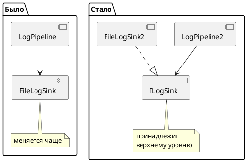

# SOLID: пять принципов проектирования классов

Материал занятий 1–2 и части B лабораторной работы 1.

Это не паттерн, поэтому структура главы отличается от остальных: вместо
«проблема — решение — диаграмма» здесь пять принципов, у каждого свой разбор.
Общее с остальными главами одно: все примеры — на домене обработки логов,
том же, что в коде репозитория.

---

## Зачем принципы, если есть паттерны

Паттерны отвечают на вопрос «как сделать», принципы — «зачем именно так».
Половина паттернов курса выводится из SOLID напрямую:

| Принцип | Какие паттерны из него следуют |
|---|---|
| OCP | [Стратегия](Поведенческие/Strategy.md), [Декоратор](Структурные/Decorator.md), [Посетитель](Поведенческие/Visitor.md) |
| DIP | [Абстрактная фабрика](Порождающие/AbstractFactory.md), [Адаптер](Структурные/Adapter.md), внедрение зависимостей |
| SRP | [Строитель](Порождающие/Builder.md), [Заместитель](Структурные/Proxy.md), [Посетитель](Поведенческие/Visitor.md) |
| ISP | Разделение широких интерфейсов перед применением любого структурного паттерна |
| LSP | Ограничение на всякую иерархию, которую строит [Шаблонный метод](Поведенческие/TemplateMethod.md) |

Поэтому в курсе SOLID идёт **до** паттернов, а не после.

Аббревиатуру собрал Роберт Мартин; сами принципы старше и сформулированы разными людьми
в 1970–1990-х. Порядок букв — следствие удачной аббревиатуры, а не важности:
на практике чаще всего нарушаются SRP и DIP.

---

## Общий пример: класс, который делает всё

Разбор всех пяти принципов идёт на одном классе — `LogProcessingModule`.
Он лежит в репозитории и является входными данными к лабораторной работе 1:

```bash
dotnet run --project Implementation -- god-object
```

Файл: [`_AntiPatterns/GodObject/LogProcessingModule.cs`](../DesignPatterns/Implementation/_AntiPatterns/GodObject/LogProcessingModule.cs)

Класс читает конфигурацию, открывает соединение с базой, разбирает строки лога,
фильтрует их, форматирует, решает, куда отправить, и пишет. Полторы сотни строк,
в которых нарушены все пять принципов сразу.

---

## S — Single Responsibility Principle

> У класса должна быть только одна причина для изменения.

### Что это значит на самом деле

Формулировка «класс должен делать одну вещь» — неточная и вредная: под неё
подходит любой класс с одним методом, и она провоцирует дробить код на бессмысленные
кусочки. Речь не о количестве действий, а о **причинах изменения**.

Причина изменения — это заинтересованная сторона, которая может потребовать правку.
У `LogProcessingModule` таких сторон шесть:

| Кто просит | Что меняется | Метод |
|---|---|---|
| Администратор | Формат конфигурационного файла | `LoadConfig` |
| DBA | Способ подключения к хранилищу | `OpenSinks` |
| Разработчик источника | Формат строки лога | `ParseLine` |
| Служба поддержки | Формат вывода | `Format` |
| Инфраструктура | Куда писать | `Write` |
| Аналитик | Какие записи важны | фильтрация в `Run` |

Шесть причин — шесть классов. Не потому, что «файлов должно быть много»,
а потому, что каждая правка одной стороны сейчас задевает код остальных
и требует перепроверять всё.

### Как выглядит соблюдение

```csharp
// Каждый класс меняется по одной причине.
public interface ILogSource      { IEnumerable<string> ReadLines(); }
public interface ILogParser      { LogRecord Parse(string line); }
public interface ILogFilter      { bool ShouldProcess(LogRecord record); }
public interface ILogFormatter   { string Format(LogRecord record); }
public interface ILogSink        { void Write(string text); }

// Координатор ничего не вычисляет — только соединяет.
public class LogPipeline
{
    private readonly ILogSource _source;
    private readonly ILogParser _parser;
    private readonly ILogFilter _filter;
    private readonly ILogFormatter _formatter;
    private readonly ILogSink _sink;

    public LogPipeline(ILogSource source, ILogParser parser, ILogFilter filter,
                       ILogFormatter formatter, ILogSink sink)
    {
        _source = source; _parser = parser; _filter = filter;
        _formatter = formatter; _sink = sink;
    }

    public void Run()
    {
        foreach (var line in _source.ReadLines())
        {
            var record = _parser.Parse(line);

            if (record != null && _filter.ShouldProcess(record))
            {
                _sink.Write(_formatter.Format(record));
            }
        }
    }
}
```

### Типичные ошибки

* **Разнести код по файлам и решить, что готово.** Пять файлов, каждый из которых
  всё равно правится при смене формата логов, — это тот же god-класс, только рассыпанный.
* **Дробить до бессмысленного.** Класс `SeverityComparer` с единственным методом
  на две строки, используемый в одном месте, — это не SRP, а лишний уровень.
* **Считать SRP оправданием любого интерфейса.** Интерфейс нужен там, где будет
  вторая реализация или где нужна подмена в тесте. В остальных случаях достаточно класса.

Проверочный вопрос: **кто придёт с требованием изменить этот класс?**
Если можно назвать двух разных людей с разными интересами — SRP нарушен.

---

## O — Open-Closed Principle

> Программные сущности должны быть открыты для расширения и закрыты для изменения.

### Где нарушается

В `LogProcessingModule` три `switch` по типу приёмника: в `OpenSinks`, в `Write`
и косвенно в `Format`. Добавление одного приёмника требует правки трёх методов,
и забыть один из них ничто не мешает — программа соберётся.

```csharp
switch (_config["sink"])
{
    case "database": ...
    case "file": ...
    case "console": ...
}
```

### Как выглядит соблюдение

Ветвление заменяется полиморфизмом — это и есть [Стратегия](Поведенческие/Strategy.md):

```csharp
public class FileLogSink : ILogSink { ... }
public class ConsoleLogSink : ILogSink { ... }
public class DatabaseLogSink : ILogSink { ... }

// Новый приёмник — новый файл. Ни один существующий не открывается.
public class TelegramLogSink : ILogSink { ... }
```

### Как проверить

Формальный критерий, который используется в лабораторной работе 1:
добавьте новый приёмник и выполните `git diff`. Если в выводе есть хоть один
существующий файл — OCP не соблюдён.

### Когда нарушить правильнее

OCP стоит денег: каждая точка расширения — это интерфейс, реализация и место сборки.
Закладывать расширяемость там, где её не будет, — та же ошибка, что и не закладывать
там, где она нужна.

Практическое правило: **первый раз пишите просто, на втором похожем случае — обобщайте.**
Один приёмник — обычный класс. Два — уже интерфейс.

---

## L — Liskov Substitution Principle

> Объекты базового типа должны заменяться объектами производного типа
> без изменения корректности программы.

Формулировка Барбары Лисков сложнее прочих, но смысл простой: **наследник не должен
удивлять того, кто работает с базовым типом.**

### Три способа нарушить

**1. Ужесточить предусловие.** Базовый класс принимает любую запись, наследник —
только непустые:

```csharp
public class ConsoleLogSink : ILogSink
{
    public virtual void Write(string text) { /* пишет что угодно */ }
}

public class DatabaseLogSink : ConsoleLogSink
{
    public override void Write(string text)
    {
        // Нарушение: клиент базового типа об этом требовании не знает.
        if (text.Length > 4000) throw new ArgumentException("Слишком длинная запись");
        ...
    }
}
```

**2. Ослабить постусловие.** Метод `Write` в базовом типе гарантирует, что запись
сохранена. Наследник с буферизацией — уже нет: при падении процесса буфер потерян.
Если это не отражено в контракте, клиент будет считать данные сохранёнными.

**3. Бросить исключение там, где базовый тип этого не делает.** Классика —
наследник, который не поддерживает часть операций:

```csharp
public class ReadOnlyLogStorage : ILogStorage
{
    public void Add(LogRecord record) =>
        throw new NotSupportedException();   // нарушение LSP
}
```

Если в коде появляется `if (storage is ReadOnlyLogStorage)`, значит подстановка
не работает и иерархия построена неправильно.

### Признак нарушения

**Проверка типа перед вызовом.** Как только клиенту приходится выяснять,
какой именно наследник ему подсунули, LSP нарушен — независимо от того,
насколько красиво выглядит иерархия.

### Как чинить

Обычно проблема не в наследнике, а в том, что абстракция выбрана неудачно.
Классический пример — квадрат и прямоугольник: математически квадрат
частный случай прямоугольника, но `Rectangle` с изменяемыми сторонами
и `Square` не образуют корректной иерархии. Решение — либо неизменяемые типы,
либо общий интерфейс `IShape` без наследования одного от другого.

В LogHub то же самое: `ILogSink` (только пишет) и `ILogStorage` (пишет и читает) —
два интерфейса, а не базовый и наследник.

---

## I — Interface Segregation Principle

> Клиенты не должны зависеть от методов, которые они не используют.

### Где нарушается

В том же файле лежит «универсальный» интерфейс приёмника:

```csharp
public interface ILogSink
{
    void Write(string text);
    void Flush();
    void BeginTransaction();
    void Commit();
    void Rollback();
    void Rotate();
    long GetFileSize();
    void SetConsoleColor(ConsoleColor color);
}
```

Реализовать его целиком не может никто. Консоль не умеет транзакций,
база не умеет ротации файлов, файл не умеет менять цвет. Каждая реализация
получает набор заглушек — а заглушка, бросающая `NotSupportedException`,
это уже нарушение LSP. Так ISP и LSP оказываются связаны:
**широкий интерфейс почти всегда порождает нарушение подстановки.**

### Как выглядит соблюдение

```csharp
public interface ILogSink       { void Write(string text); }
public interface IFlushable     { void Flush(); }
public interface ITransactional { void BeginTransaction(); void Commit(); void Rollback(); }
public interface IRotatable     { void Rotate(); long GetFileSize(); }

// Каждый приёмник реализует ровно то, что умеет.
public class ConsoleLogSink  : ILogSink { ... }
public class FileLogSink     : ILogSink, IFlushable, IRotatable { ... }
public class DatabaseLogSink : ILogSink, ITransactional { ... }
```

Клиент запрашивает то, что ему нужно:

```csharp
public LogPipeline(ILogSink sink) { ... }              // достаточно записи
public BatchWriter(ILogSink sink, IFlushable flush) { } // нужен ещё и сброс
```

### Ориентир

Интерфейс с одним-тремя методами — норма. Пять — повод задуматься.
Десять — почти наверняка нарушение. Но считать методы бессмысленно
без второго вопроса: **есть ли реализация, которой часть методов не нужна?**
Если есть — делите.

---

## D — Dependency Inversion Principle

> Модули верхнего уровня не должны зависеть от модулей нижнего уровня.
> И те и другие должны зависеть от абстракций.
>
> Абстракции не должны зависеть от деталей. Детали должны зависеть от абстракций.

### Что инвертируется

Обычный поток зависимостей направлен вниз: бизнес-логика зависит от базы данных,
файловой системы, сети. При этом меняются как раз нижние уровни — база, библиотека,
формат файла, — и каждое такое изменение поднимается наверх.

DIP разворачивает стрелку: интерфейс объявляет **верхний** уровень, потому что это
его потребность, а нижний уровень его реализует.



Ключевая деталь, которую обычно упускают: **`ILogSink` объявляется рядом
с `LogPipeline`, а не рядом с `FileLogSink`.** Иначе зависимость никуда
не делась, просто стала косвенной.

### Где нарушается

```csharp
private FakeDbConnection _connection;                       // конкретный тип
_fileWriter = new StreamWriter($"logs-{DateTime.Now:yyyyMMdd}.txt");  // new внутри
foreach (var line in File.ReadLines(logPath))               // статический класс
```

Последствие видно сразу: юнит-тест на разбор строки лога невозможен без настоящего
файла на настоящем диске. Тестируемость — самый надёжный индикатор DIP:
**если класс нельзя протестировать без внешнего мира, DIP нарушен.**

### Как выглядит соблюдение

```csharp
public class LogPipeline
{
    private readonly ILogSource _source;
    private readonly ILogSink _sink;

    // Зависимости приходят снаружи. Внутри — ни одного new для сервисов.
    public LogPipeline(ILogSource source, ILogSink sink)
    {
        _source = source;
        _sink = sink;
    }
}
```

Кто же тогда вызывает `new`? Один-единственный класс на всё приложение —
композиционный корень. Об этом отдельная глава: [IoC и внедрение зависимостей](IoC_и_DI.md).

### Чего DIP не требует

* **Интерфейса для каждого класса.** Абстракция нужна там, где деталь может
  измениться или где нужна подмена в тесте. `LogRecord` — данные, интерфейс ему не нужен.
* **DI-контейнера.** Внедрение зависимостей прекрасно работает через обычные
  конструкторы; контейнер только автоматизирует сборку.

---

## Как принципы связаны между собой

Они не независимы: нарушение одного тянет остальные.

```
Широкий интерфейс (ISP)
   → реализации бросают NotSupportedException (LSP)
   → клиент проверяет типы через is
   → появляется switch по типу (OCP)
   → класс знает обо всех реализациях (DIP)
   → и меняется по любой из их причин (SRP)
```

Поэтому в лабораторной работе 1 нарушения ищутся не по отдельности,
а как одна связанная картина, и рефакторинг делается за один заход.

---

## Что не является SOLID

Несколько распространённых заблуждений:

* **«Чем больше интерфейсов, тем лучше».** Интерфейс с одной реализацией,
  которую никто не подменяет, — накладной расход без выгоды.
* **«SOLID требует слоёв, репозиториев и абстрактных фабрик».**
  Это архитектурные решения, у них своя цена. SOLID — про классы.
* **«Нарушать SOLID нельзя».** Можно и нужно, если цена соблюдения выше выгоды.
  Скрипт на сто строк, который отработает один раз, не нуждается ни в одном
  из пяти принципов.
* **«Больше файлов = больше сложности».** Наоборот: сложность создаётся связями,
  а не количеством файлов. Пятнадцать классов с одной обязанностью каждый
  проще одного класса на полторы тысячи строк.

---

## Код

* Антипример: [`_AntiPatterns/GodObject/LogProcessingModule.cs`](../DesignPatterns/Implementation/_AntiPatterns/GodObject/LogProcessingModule.cs)
  ```bash
  dotnet run --project Implementation -- god-object
  ```
* Пример соблюдения DIP: [`Ioc/IocApp.cs`](../DesignPatterns/Implementation/Ioc/IocApp.cs)
  ```bash
  dotnet run --project Implementation -- ioc
  ```

Эталонное решение рефакторинга выдаётся преподавателем и в студенческом
репозитории отсутствует намеренно.

---

## Вывод

SOLID — не свод правил, а пять способов задать себе один вопрос:
**что произойдёт с этим кодом, когда потребуется его изменить.**

Если ответ «придётся править класс, который к изменению отношения не имеет» —
нарушен SRP или OCP. Если «придётся проверить, какой это наследник» — LSP.
Если «придётся реализовать методы, которые мне не нужны» — ISP.
Если «нельзя протестировать без базы» — DIP.

Все паттерны курса — это отработанные ответы на эти вопросы. Понимать принципы
важнее, чем помнить названия паттернов: принципы подскажут решение и там,
где готового паттерна нет.

---

[← Оглавление учебника](README.md)
