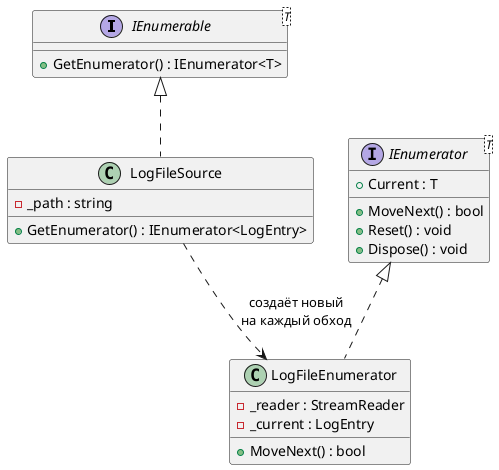
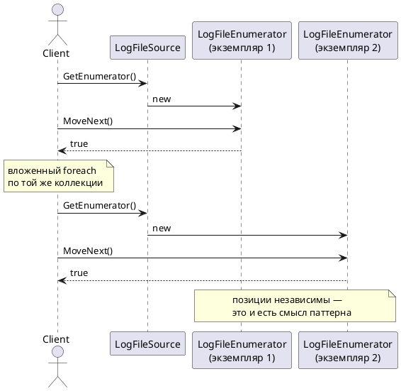

# Iterator (Итератор)

## Уникальное название

**Iterator (Итератор)**
Также известен как: *Cursor*, *Enumerator*.
Категория: поведенческий, уровень объекта.

---

## Описание решаемой проблемы

### Проблема

Логи хранятся в источнике — файле на диске, кольцевом буфере в памяти, графе зависимостей
сервисов. Клиенту нужно пройти по записям, ничего не зная о том, как они лежат внутри.

Наивное решение — отдать клиенту внутреннюю структуру:

```csharp
public class LogFileSource
{
    public List<LogEntry> Entries { get; }   // всё наружу
}

for (var i = 0; i < source.Entries.Count; i++) { ... }
```

Проблемы:

1. **Внутреннее устройство стало публичным контрактом.** Заменить `List` на кольцевой
   буфер или ленивое чтение из файла уже нельзя — сломаются все клиенты.
2. **Клиент может испортить коллекцию.** `source.Entries.Clear()` компилируется.
3. **Файл читается целиком.** Чтобы посмотреть первые десять записей лога на 2 ГБ,
   придётся загрузить в память все.
4. **Способ обхода один.** Граф зависимостей нужно обходить и в глубину, и в ширину;
   индекс в списке этого не выражает.

Вторая по популярности ошибка — сделать коллекцию собственным итератором:

```csharp
// АНТИПРИМЕР
class MyCollection : IEnumerable, IEnumerator
{
    private int _position = -1;   // позиция обхода хранится в самой коллекции
    public bool MoveNext() => ++_position < _items.Count;
    public IEnumerator GetEnumerator() => this;
}
```

Такой класс выглядит короче, но:

* два вложенных `foreach` по одной коллекции сбивают друг другу позицию;
* коллекцию нельзя обходить из нескольких потоков;
* повторный обход требует ручного `Reset()`.

Рабочий антипример лежит в репозитории:
[`_AntiPatterns/Enumerator/MyCollection.cs`](../../DesignPatterns/Implementation/_AntiPatterns/Enumerator/MyCollection.cs).

### Примеры задач

1. **LogHub.** Ленивое чтение записей из файла: клиент видит последовательность
   `LogEntry`, файл читается построчно.
2. **Граф зависимостей сервисов.** Один и тот же граф обходится в глубину и в ширину —
   два итератора над одной структурой (ЛР 3).
3. **`IEnumerable<T>` в .NET.** Весь LINQ построен на этом паттерне.

---

## Описание способа решения

Состояние обхода выносится в **отдельный объект** — итератор. Коллекция умеет только
выдавать новый итератор; сам обход её не касается.

Ключевая мысль: **позиция обхода принадлежит обходу, а не коллекции.**
Именно поэтому итераторов может быть сколько угодно и они не мешают друг другу.

В .NET паттерн встроен в язык:

| Роль GoF | Тип в .NET |
|---|---|
| Aggregate | `IEnumerable<T>` |
| Iterator | `IEnumerator<T>` |
| ConcreteAggregate | ваш класс коллекции |
| ConcreteIterator | класс с `MoveNext`/`Current` или сгенерированный из `yield return` |

Оператор `foreach` — синтаксический сахар над `GetEnumerator()`, `MoveNext()`, `Current`
и `Dispose()`.

### Участники

| Роль | Класс в примере | Ответственность |
|---|---|---|
| Aggregate | `IEnumerable<LogEntry>` | Умеет создавать итератор |
| ConcreteAggregate | `LogFileSource` | Хранит данные, реализует `GetEnumerator()` |
| Iterator | `IEnumerator<LogEntry>` | `MoveNext()`, `Current`, `Reset()`, `Dispose()` |
| ConcreteIterator | `LogFileEnumerator` | Хранит позицию и умеет двигаться дальше |

---

## Диаграмма и способ реализации

### Диаграмма классов



### Диаграмма последовательности



---

## Реализация на C#

### 1. Итератор вручную

```csharp
public class LogFileSource : IEnumerable<LogEntry>
{
    private readonly string _path;

    public LogFileSource(string path) => _path = path;

    // Новый итератор на каждый вызов — обходы не мешают друг другу.
    public IEnumerator<LogEntry> GetEnumerator() => new LogFileEnumerator(_path);

    IEnumerator IEnumerable.GetEnumerator() => GetEnumerator();
}

public class LogFileEnumerator : IEnumerator<LogEntry>
{
    private readonly string _path;
    private StreamReader _reader;

    public LogFileEnumerator(string path)
    {
        _path = path;
        _reader = new StreamReader(path);
    }

    public LogEntry Current { get; private set; }

    object IEnumerator.Current => Current;

    public bool MoveNext()
    {
        var line = _reader.ReadLine();
        if (line == null)
        {
            return false;
        }

        Current = LogEntry.Parse(line);
        return true;
    }

    public void Reset()
    {
        _reader.Dispose();
        _reader = new StreamReader(_path);
        Current = null;
    }

    public void Dispose() => _reader?.Dispose();
}
```

Тридцать строк ради обхода. Хорошая новость: писать их обычно не нужно.

### 2. Итератор через `yield return`

```csharp
public class LogFileSource : IEnumerable<LogEntry>
{
    private readonly string _path;

    public LogFileSource(string path) => _path = path;

    public IEnumerator<LogEntry> GetEnumerator()
    {
        using var reader = new StreamReader(_path);

        string line;
        while ((line = reader.ReadLine()) != null)
        {
            yield return LogEntry.Parse(line);
        }
    }

    IEnumerator IEnumerable.GetEnumerator() => GetEnumerator();
}
```

Компилятор превращает метод с `yield return` в конечный автомат — класс с полем состояния,
полем `Current` и методом `MoveNext`, в котором тело метода разрезано на куски по точкам
`yield`. Локальные переменные становятся полями этого класса, `using` превращается
в реализацию `Dispose`. Ровно то же, что в предыдущем пункте, только автоматически.

Проверить можно в любом декомпиляторе: рядом с классом появится вложенный
`<GetEnumerator>d__2` с полем `<>1__state`.

### 3. Два способа обхода одной структуры

Когда обходов несколько, `GetEnumerator()` не хватает — нужны именованные методы,
каждый возвращает свою последовательность:

```csharp
public class DependencyGraph
{
    private readonly Dictionary<Node, List<Node>> _edges = new();

    public IEnumerable<Node> DepthFirst(Node start)
    {
        var visited = new HashSet<Node>();
        var stack = new Stack<Node>();
        stack.Push(start);

        while (stack.Count > 0)
        {
            var node = stack.Pop();
            if (!visited.Add(node))   // защита от циклов
            {
                continue;
            }

            yield return node;

            foreach (var next in _edges[node])
            {
                stack.Push(next);
            }
        }
    }

    public IEnumerable<Node> BreadthFirst(Node start)
    {
        var visited = new HashSet<Node> { start };
        var queue = new Queue<Node>();
        queue.Enqueue(start);

        while (queue.Count > 0)
        {
            var node = queue.Dequeue();
            yield return node;

            foreach (var next in _edges[node].Where(visited.Add))
            {
                queue.Enqueue(next);
            }
        }
    }
}
```

Обход в глубину и в ширину отличаются только структурой данных: стек против очереди.
`visited` нужен обязательно — граф зависимостей может содержать цикл,
и без проверки обход не завершится.

```csharp
foreach (var service in graph.DepthFirst(root))
{
    foreach (var dependency in graph.BreadthFirst(service))   // вложенный обход работает
    {
        Console.WriteLine($"{service} → {dependency}");
    }
}
```

### 4. Асинхронный итератор

Если источник обращается к сети или БД, обход тоже становится асинхронным:

```csharp
public async IAsyncEnumerable<LogEntry> ReadAsync(
    [EnumeratorCancellation] CancellationToken token = default)
{
    await foreach (var row in _db.QueryAsync(token))
    {
        yield return LogEntry.From(row);
    }
}

await foreach (var entry in source.ReadAsync(token)) { ... }
```

`IAsyncEnumerator<T>.MoveNextAsync()` возвращает `ValueTask<bool>` вместо `bool` —
это тот же паттерн, только каждый шаг может ждать.

---

## Плюсы и минусы

### Плюсы

* Внутреннее устройство коллекции скрыто; реализацию можно менять свободно.
* Обходов может быть несколько и они не мешают друг другу.
* Один клиентский код работает с любой коллекцией: `foreach` не знает, что перед ним.
* Ленивость: элементы вычисляются по одному, вся коллекция в память не грузится.
* Разные способы обхода одной структуры — просто разные итераторы.

### Минусы

* Для простого массива это лишний уровень косвенности и медленнее прямого индексирования.
* Итератор портится при изменении коллекции: .NET на это бросает
  `InvalidOperationException` — «Collection was modified».
* Ленивый итератор откладывает и ошибки: исключение из `ReadLine` вылетит
  не при создании последовательности, а в середине `foreach`.
* Ленивую последовательность легко случайно перечислить дважды и выполнить работу два раза.

---

## Области применения

* **В .NET:** `IEnumerable<T>` и весь LINQ, `IAsyncEnumerable<T>`, `yield return`,
  `Channel<T>.ReadAllAsync()`, курсоры в EF Core.
* **В LogHub:** ленивое чтение файла логов, обход графа зависимостей сервисов
  в глубину и в ширину (ЛР 3).

---

## Сравнение с соседними паттернами

| Паттерн | Чем похож | Чем отличается |
|---|---|---|
| [Компоновщик](../Структурные/Composite.md) | Часто обходится итератором | Компоновщик описывает структуру, Итератор — способ по ней пройти |
| [Посетитель](Visitor.md) | Оба работают со всеми элементами структуры | Итератор даёт элементы по одному, Посетитель добавляет над ними операцию |
| [Фабричный метод](../Порождающие/FactoryMethod.md) | `GetEnumerator()` — это он и есть | Создаваемый объект здесь всегда итератор |

---

## Когда НЕ применять

* **Когда структура — обычный массив или список.** `IEnumerable<T>` там уже есть,
  писать свой итератор незачем.
* **Когда нужен произвольный доступ.** Итератор двигается только вперёд;
  «дай элемент №42» им не выражается — нужен индексатор.
* **Когда важна каждая наносекунда.** В горячем цикле обход по индексу
  быстрее последовательности виртуальных вызовов `MoveNext`.
* **Когда коллекция меняется во время обхода.** Итератор для этого не предназначен;
  берите снимок (`ToList()`) или конкурентную коллекцию.

---

## Код

Рабочий пример: [`Implementation/Behavioral/Iterator/`](../../DesignPatterns/Implementation/Behavioral/Iterator/)

```bash
dotnet run --project Implementation -- iterator
dotnet run --project Implementation -- iterator-enumerable
dotnet run --project Implementation -- graph
```

* `Aggregate.cs`, `Iterator.cs`, `ConcreteIterator.cs` — каноническая схема GoF.
* `LogFileSource.cs` — итератор над источником логов.
* `EnumerableAggregate.cs` — вариант через `yield return`.
* `Graphs/` — обход графа в глубину и в ширину (заготовка к ЛР 3).

Антипример «коллекция сама себе итератор» — `dotnet run --project Implementation -- anti-enumerator`.

---

## Вывод

Итератор отвечает на вопрос «как пройти по коллекции, не зная её устройства»,
и главное правило здесь одно: **состояние обхода живёт в итераторе, а не в коллекции.**
Нарушение этого правила и даёт классическую ошибку с вложенными циклами.

В C# паттерн встроен в язык, поэтому писать `MoveNext` руками почти никогда не нужно —
достаточно `yield return`. Понимать, во что он разворачивается, всё равно полезно:
без этого не объяснить ни отложенное выполнение, ни неожиданные исключения
в середине `foreach`.

---

[← Оглавление учебника](../README.md)
