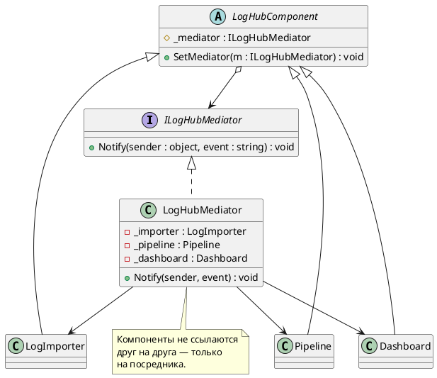
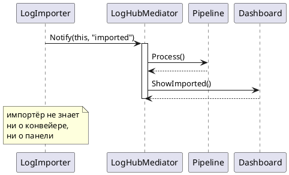

# Mediator (Посредник)

## Уникальное название

**Mediator (Посредник)**
Также известен как: *Controller*.
Категория: поведенческий, уровень объекта.

---

## Описание решаемой проблемы

### Проблема

В LogHub несколько компонентов, которые обязаны реагировать друг на друга.
Импортёр прочитал порцию записей — конвейер должен запуститься. Конвейер отработал —
приёмники должны записать, счётчик обновиться, панель мониторинга перерисоваться.
Приёмник упал — импортёр должен притормозить.

Если связывать их напрямую, каждый компонент получает ссылки на все остальные:

```csharp
public class LogImporter
{
    private readonly Pipeline _pipeline;
    private readonly Dashboard _dashboard;
    private readonly ThrottleController _throttle;

    public void Import()
    {
        var entries = Read();
        _pipeline.Process(entries);
        _dashboard.ShowImported(entries.Count);
        if (_throttle.ShouldPause) { /* ... */ }
    }
}

public class Pipeline
{
    private readonly LogImporter _importer;     // обратная ссылка
    private readonly Dashboard _dashboard;
    private readonly List<ILogSink> _sinks;
    // ...
}
```

Что получается:

1. **Связей растёт квадратично.** Четыре компонента — до двенадцати направленных связей;
   восемь — до пятидесяти шести. Схема взаимодействия перестаёт помещаться в голову.
2. **Ни один компонент нельзя переиспользовать.** `Pipeline` тянет за собой `Dashboard`,
   `Dashboard` — `LogImporter`, и так по кругу.
3. **Циклические зависимости.** Импортёр знает о конвейере, конвейер об импортёре.
   Создать такой граф через конструкторы невозможно — приходится городить сеттеры
   и двухфазную инициализацию.
4. **Логика взаимодействия размазана.** Ответ на вопрос «что происходит после импорта»
   собирается из четырёх файлов.
5. **Изменение правил задевает всех.** Понадобилось не запускать конвейер по выходным —
   правится `LogImporter`, хотя расписание к импорту отношения не имеет.

### Примеры задач

1. **LogHub.** Координация импортёра, конвейера, приёмников и панели мониторинга.
2. **Диалоговое окно.** Кнопка «Сохранить» активна, только если заполнено поле имени
   и выбран хотя бы один пункт списка. Классический пример из книги GoF: элементы
   формы не должны знать друг о друге.
3. **Диспетчер аэропорта.** Самолёты не договариваются между собой о посадке —
   они говорят с вышкой.

---

## Описание способа решения

Вводится отдельный объект — посредник. Компоненты больше не ссылаются друг на друга;
каждый знает только посредника и сообщает ему о событиях. Посредник решает,
кого и как уведомить.

Ключевая мысль: **связи «все со всеми» заменяются на «все с одним».**
Граф из сети превращается в звезду.

Побочный, но важный эффект: правила взаимодействия становятся видимыми.
Раньше ответ на вопрос «что происходит после импорта» надо было собирать
по всем файлам, теперь он записан в одном методе посредника.

### Участники

| Роль | Класс в примере | Ответственность |
|---|---|---|
| Mediator | `ILogHubMediator` | Интерфейс для оповещения посредника |
| ConcreteMediator | `LogHubMediator` | Знает всех коллег и правила их взаимодействия |
| Colleague | `LogHubComponent` | Базовый класс: хранит ссылку на посредника |
| ConcreteColleague | `LogImporter`, `Pipeline`, `Dashboard` | Сообщает посреднику о событиях, не зная о других коллегах |

---

## Диаграмма и способ реализации

### Диаграмма классов



### Диаграмма последовательности



---

## Реализация на C#

### 1. Интерфейс посредника и базовый коллега

```csharp
public interface ILogHubMediator
{
    void Notify(object sender, string @event);
}

public abstract class LogHubComponent
{
    protected ILogHubMediator Mediator;

    public void SetMediator(ILogHubMediator mediator) => Mediator = mediator;
}
```

### 2. Коллеги

```csharp
public class LogImporter : LogHubComponent
{
    public List<LogEntry> Buffer { get; } = new List<LogEntry>();

    public void Import()
    {
        Buffer.AddRange(Read());
        Mediator.Notify(this, "imported");   // просто сообщаем о факте
    }

    public void Pause() => Console.WriteLine("Импорт приостановлен");
}

public class Pipeline : LogHubComponent
{
    public bool Overloaded { get; private set; }

    public void Process(IReadOnlyList<LogEntry> entries)
    {
        Overloaded = entries.Count > 10_000;

        if (Overloaded)
        {
            Mediator.Notify(this, "overloaded");
        }
    }
}

public class Dashboard : LogHubComponent
{
    public void ShowImported(int count) => Console.WriteLine($"Импортировано: {count}");
}
```

Ни один коллега не упоминает другого. Каждый из них можно взять в другой проект
или в тест по отдельности.

### 3. Посредник

```csharp
public class LogHubMediator : ILogHubMediator
{
    private readonly LogImporter _importer;
    private readonly Pipeline _pipeline;
    private readonly Dashboard _dashboard;

    public LogHubMediator(LogImporter importer, Pipeline pipeline, Dashboard dashboard)
    {
        _importer = importer;
        _pipeline = pipeline;
        _dashboard = dashboard;

        _importer.SetMediator(this);
        _pipeline.SetMediator(this);
        _dashboard.SetMediator(this);
    }

    // Все правила взаимодействия — в одном месте.
    public void Notify(object sender, string @event)
    {
        switch (@event)
        {
            case "imported":
                _pipeline.Process(_importer.Buffer);
                _dashboard.ShowImported(_importer.Buffer.Count);
                break;

            case "overloaded":
                _importer.Pause();
                break;
        }
    }
}
```

`switch` здесь не случайность и не недостаток: посредник **должен** знать все правила,
это его единственная обязанность. Схему взаимодействия видно целиком, не открывая
другие файлы.

### 4. Сборка

```csharp
var mediator = new LogHubMediator(new LogImporter(), new Pipeline(), new Dashboard());
```

### 5. Типизированные события вместо строк

Строковые имена событий не проверяются компилятором. В боевом коде их заменяют
на события C# или на типизированные сообщения:

```csharp
public interface ILogHubMediator
{
    void Notify(ImportCompleted message);
    void Notify(PipelineOverloaded message);
}
```

Такой вариант надёжнее, но интерфейс посредника разрастается. Для трёх-четырёх
событий строк достаточно, дальше стоит переходить на типы.

---

## Плюсы и минусы

### Плюсы

* Связность падает: компоненты знают только посредника.
* Правила взаимодействия собраны в одном месте и читаются целиком.
* Компоненты переиспользуются и тестируются по отдельности —
  в тест подставляется мок посредника.
* Схему взаимодействия можно менять, не трогая ни один компонент.
* Циклические зависимости исчезают: граф становится звездой.

### Минусы

* **Посредник растёт.** С добавлением компонентов он рискует стать god-объектом —
  классом, который знает всё обо всех. Это главная опасность паттерна.
* Косвенность: чтобы понять, что произойдёт после `Notify`, нужно открыть посредника.
* Посредник — единая точка отказа: ошибка в нём ломает всё взаимодействие.
* Для двух-трёх компонентов накладные расходы больше выигрыша.

---

## Области применения

* **В .NET:** контроллеры MVC — координируют модель и представление;
  библиотека MediatR — популярная реализация паттерна для CQRS;
  `IServiceProvider` отчасти играет ту же роль.
* **Пользовательские интерфейсы.** Элементы формы, влияющие на доступность
  и содержимое друг друга.
* **В LogHub:** координация импортёра, конвейера и мониторинга (занятие 4).

---

## Сравнение с соседними паттернами

| Паттерн | Чем похож | Чем отличается |
|---|---|---|
| [Наблюдатель](Observer.md) | Оба ослабляют связи между объектами | Наблюдатель — однонаправленное вещание «источник → подписчики», подписчики друг о друге не знают и о них не знает источник. Посредник — двусторонняя координация, он знает всех |
| [Фасад](../Структурные/Facade.md) | Оба вводят промежуточный объект | Фасад односторонний: клиент вызывает подсистему, подсистема о фасаде не знает. У посредника коллеги знают о нём и обращаются к нему |
| [Цепочка обязанностей](ChainOfResponsibility.md) | Оба развязывают отправителя и получателя | Цепочка передаёт запрос по линии до первого обработчика, посредник рассылает по правилам |

**Посредник и Наблюдатель часто сочетают:** посредник реализуется как источник
событий, а коллеги подписываются на нужные им. Тогда исчезает `switch`, но правила
взаимодействия снова расползаются по подписчикам — это осознанный размен.

---

## Когда НЕ применять

* **Когда компонентов два-три и связи простые.** Прямой вызов понятнее посредника.
* **Когда взаимодействие однонаправленное.** Если A уведомляет B, C и D, а обратной
  связи нет, нужен [Наблюдатель](Observer.md) — он проще.
* **Когда посредник уже стал god-объектом.** Если в `Notify` двадцать веток
  и он знает о десяти компонентах, паттерн не решил проблему, а собрал её в одном файле.
  Делите на несколько посредников по областям ответственности.
* **Когда компоненты образуют конвейер.** Последовательная обработка —
  это [Цепочка обязанностей](ChainOfResponsibility.md), а не посредник.

---

## Код

Рабочий пример: [`Implementation/Behavioral/Mediator/`](../../DesignPatterns/Implementation/Behavioral/Mediator/)

```bash
dotnet run --project Implementation -- mediator
```

* `LogHubComponents.cs` — интерфейс посредника, базовый коллега и три компонента
  (`LogImporter`, `Pipeline`, `Dashboard`). Ни один из них не ссылается на другой.
* `LogHubMediator.cs` — конкретный посредник со всеми правилами взаимодействия
  и демонстрация обратной связи: конвейер приостанавливает импортёр,
  не имея на него ссылки.

Смежный пример — [`Behavioral/Observer/`](../../DesignPatterns/Implementation/Behavioral/Observer/),
на котором посредник часто строится: `dotnet run --project Implementation -- observer`

---

## Вывод

Посредник нужен, когда объектов много, связи между ними двусторонние, а схема
взаимодействия меняется чаще самих объектов. Он превращает сеть в звезду
и делает правила видимыми.

Плата известна заранее: сложность не исчезает, а переезжает в посредника.
Поэтому главный вопрос при применении — не «стало ли меньше связей»,
а «не превратился ли посредник в божественный объект». Если превратился,
паттерн применён неудачно.

---

[← Оглавление учебника](../README.md)
