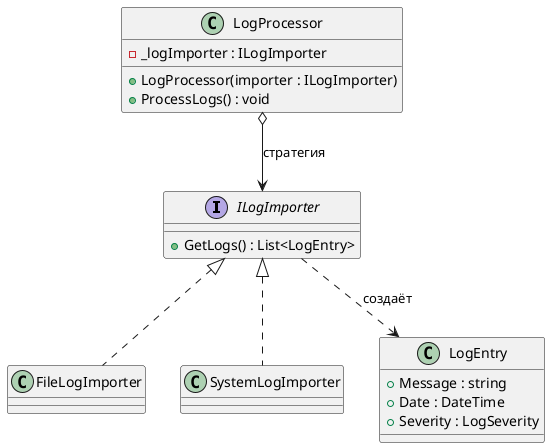
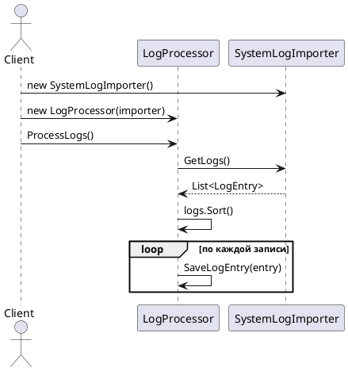

# Strategy (Стратегия)

## Уникальное название

**Strategy (Стратегия)**
Также известен как: *Policy*.
Категория: поведенческий, уровень объекта.

---

## Описание решаемой проблемы

### Проблема

Система собирает логи и обрабатывает их: сортирует, фильтрует, раскладывает по приёмникам.
Источник логов при этом бывает разным — файл на диске, системный журнал, HTTP-эндпоинт,
таблица в базе. Обработка после импорта одинаковая, отличается только способ получения записей.

Первое, что приходит в голову, — `switch` внутри обработчика:

```csharp
public void ProcessLogs(string source)
{
    List<LogEntry> logs;

    switch (source)
    {
        case "file":   logs = ReadFromFile();   break;
        case "system": logs = ReadFromSystem(); break;
        case "http":   logs = ReadFromHttp();   break;
        default: throw new ArgumentException(nameof(source));
    }

    logs.Sort();
    foreach (var entry in logs) Save(entry);
}
```

Что с этим не так:

1. **Каждый новый источник требует правки `LogProcessor`.** Класс, который отвечает
   за обработку, приходится менять из-за причины, к обработке отношения не имеющей, —
   это нарушение и SRP, и OCP одновременно.
2. **Класс тянет за собой зависимости всех источников сразу.** Чтобы обработать логи
   из памяти в юнит-тесте, всё равно нужны сборки для работы с файлом, сетью и БД.
3. **Способ импорта нельзя подменить в рантайме.** Строка `source` жёстко связана
   с веткой `switch`; выбрать источник из конфигурации можно, но добавить новый —
   только пересборкой.
4. **`ProcessLogs` невозможно протестировать изолированно.** Любой тест задевает
   настоящую файловую систему или сеть.

### Примеры задач

1. **LogHub.** Импорт записей из файла, системного журнала или памяти —
   при неизменной последующей обработке.
2. **Сжатие.** Архиватор должен уметь паковать в ZIP, GZip или не паковать вовсе;
   алгоритм выбирается по расширению или по настройке.
3. **Сортировка в .NET.** `List<T>.Sort(IComparer<T>)` — способ сравнения передаётся
   снаружи, сам алгоритм сортировки остаётся тем же.

---

## Описание способа решения

Изменяемую часть поведения выносят в отдельный интерфейс, а конкретные варианты —
в классы, его реализующие. Клиент хранит ссылку на интерфейс и не знает,
какая именно реализация ему подставлена.

Ключевая мысль: **вместо ветвления по типу поведения — ссылка на объект поведения.**
`switch` из кода не исчезает бесследно, он переезжает в одно место — туда,
где собирается объектный граф, то есть в [композиционный корень](../IoC_и_DI.md#композиционный-корень) или фабрику.

### Участники

| Роль | Класс в примере | Ответственность |
|---|---|---|
| Strategy | `ILogImporter` | Общий интерфейс всех вариантов поведения |
| ConcreteStrategy | `FileLogImporter`, `SystemLogImporter` | Конкретная реализация импорта |
| Context | `LogProcessor` | Хранит стратегию и вызывает её, не зная конкретного типа |
| Client | композиционный корень | Выбирает стратегию и передаёт её контексту |

---

## Диаграмма и способ реализации

### Диаграмма классов



### Диаграмма последовательности



Обратите внимание: `LogProcessor` не создаёт стратегию сам. Если бы он это делал
(`_importer = new FileLogImporter()`), паттерн бы не работал — зависимость от конкретного
класса вернулась бы на место.

---

## Реализация на C#

### 1. Интерфейс стратегии

```csharp
public interface ILogImporter
{
    List<LogEntry> GetLogs();
}
```

Интерфейс намеренно узкий — один метод. Чем меньше в нём операций,
тем дешевле написать ещё одну реализацию.

### 2. Конкретные стратегии

```csharp
public class FileLogImporter : ILogImporter
{
    private readonly string _path;

    public FileLogImporter(string path) => _path = path;

    public List<LogEntry> GetLogs() =>
        File.ReadLines(_path)
            .Select(LogEntry.Parse)
            .ToList();
}

public class SystemLogImporter : ILogImporter
{
    public List<LogEntry> GetLogs()
    {
        // обращение к системному журналу
    }
}

// Пригодится в тестах: никаких файлов и сети.
public class InMemoryLogImporter : ILogImporter
{
    private readonly List<LogEntry> _entries;

    public InMemoryLogImporter(params LogEntry[] entries) => _entries = entries.ToList();

    public List<LogEntry> GetLogs() => _entries;
}
```

### 3. Контекст

```csharp
public class LogProcessor
{
    private readonly ILogImporter _logImporter;

    public LogProcessor(ILogImporter logImporter)
    {
        _logImporter = logImporter ?? throw new ArgumentNullException(nameof(logImporter));
    }

    public void ProcessLogs()
    {
        var logs = _logImporter.GetLogs();
        logs.Sort();

        foreach (var logEntry in logs)
        {
            SaveLogEntry(logEntry);
        }
    }
}
```

`ProcessLogs` не изменится никогда — ни при добавлении источника, ни при его удалении.
Это и есть выполненное OCP: класс открыт для расширения, закрыт для изменения.

### 4. Клиент

```csharp
ILogImporter importer = config.Source switch
{
    "file"   => new FileLogImporter(config.Path),
    "system" => new SystemLogImporter(),
    _        => throw new ArgumentException($"Неизвестный источник: {config.Source}")
};

new LogProcessor(importer).ProcessLogs();
```

`switch` остался — но он один на всё приложение и живёт там, где ему и место:
в точке сборки. Обычно эту роль берёт на себя DI-контейнер или фабрика
([Factory Method](../Порождающие/FactoryMethod.md)).

### 5. Стратегия делегатом

Если у стратегии ровно один метод и ей не нужно состояние, интерфейс можно
не заводить вовсе — в C# для этого есть делегаты:

```csharp
public class LogProcessor
{
    private readonly Func<List<LogEntry>> _import;

    public LogProcessor(Func<List<LogEntry>> import) => _import = import;
}

new LogProcessor(() => File.ReadLines(path).Select(LogEntry.Parse).ToList());
```

Так короче, но теряется имя: в стеке вызовов будет анонимный метод,
а не `FileLogImporter`. Правило простое: **одна операция без состояния — делегат,
несколько связанных операций или собственное состояние — интерфейс.**

---

## Плюсы и минусы

### Плюсы

* Новый вариант поведения добавляется новым классом — существующий код не меняется (OCP).
* Поведение подменяется во время выполнения.
* Контекст тестируется изолированно: в тест подставляется тривиальная реализация.
* Уходит разросшийся `switch` или лестница `if`.
* Каждый алгоритм живёт в своём классе и тестируется отдельно.

### Минусы

* Классов становится больше. При двух вариантах, которые не будут меняться,
  это чистые накладные расходы.
* Клиент обязан знать, какие стратегии существуют, чтобы выбрать нужную.
* Стратегия и контекст связаны интерфейсом: если разным реализациям нужны разные данные,
  интерфейс начинает разбухать.

---

## Области применения

* **В .NET:** `IComparer<T>` в `List<T>.Sort`, `IEqualityComparer<T>` в словарях,
  `StringComparer.OrdinalIgnoreCase`, политики повторов в `HttpClient`,
  `JsonNamingPolicy` в `System.Text.Json`.
* **В LogHub:** выбор источника импорта (ЛР 3), формат вывода записи,
  политика повторной отправки в приёмник.

---

## Сравнение с соседними паттернами

| Паттерн | Чем похож | Чем отличается |
|---|---|---|
| [Шаблонный метод](TemplateMethod.md) | Тоже варьирует часть алгоритма | Меняет шаг через наследование на этапе компиляции; Стратегия — через композицию в рантайме |
| [Состояние](../Каталог_23_паттерна.md) | Структура классов практически совпадает | Состояние меняет себя само в зависимости от происходящего; стратегию задаёт клиент снаружи |
| [Мост](../Каталог_23_паттерна.md) | Тоже композиция вместо наследования | Мост разделяет две независимо растущие иерархии; Стратегия подменяет одну операцию |
| [Декоратор](../Структурные/Decorator.md) | Оба оборачивают поведение | Декоратор добавляет поведение поверх существующего, Стратегия заменяет его целиком |

---

## Когда НЕ применять

* **Когда вариант поведения один и второго не предвидится.** Интерфейс с единственной
  реализацией — не абстракция, а лишний файл.
* **Когда алгоритмы отличаются в мелочи.** Если из четырёх стратегий три отличаются
  одной строкой, уместнее [Шаблонный метод](TemplateMethod.md) с хуком.
* **Когда стратегия хранит изменяемое состояние и используется из нескольких потоков.**
  Один экземпляр стратегии на многих клиентов — источник гонок; либо делайте
  стратегию без состояния, либо создавайте на каждый вызов.
* **Когда выбор делается один раз при старте.** Достаточно зарегистрировать нужную
  реализацию в DI-контейнере — отдельный «переключатель стратегий» не нужен.

---

## Код

Рабочий пример: [`Implementation/Behavioral/Strategy/`](../../DesignPatterns/Implementation/Behavioral/Strategy/)

```bash
dotnet run --project Implementation -- strategy
```

В `LogProcessor.cs` — интерфейс `ILogImporter`, две реализации и контекст `LogProcessor`.
`EmployeeRunner.cs` — второй пример на другой предметной области.

---

## Вывод

Стратегия нужна ровно в тот момент, когда в коде появляется `switch` или `if`
по способу что-то сделать, и этот список способов будет расти. Паттерн не убирает
выбор, а переносит его из середины алгоритма в точку сборки объектов — там он
никому не мешает и правится в одном месте.

Признак, что Стратегия применена правильно: добавление нового варианта не требует
открывать ни один из существующих файлов.

---

[← Оглавление учебника](../README.md)
