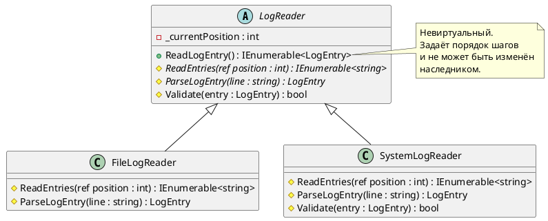
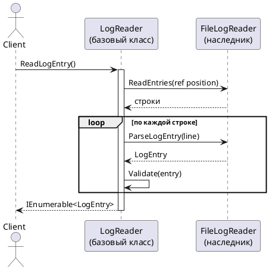

# Template Method (Шаблонный метод)

## Уникальное название

**Template Method (Шаблонный метод)**
Категория: поведенческий, уровень класса.

---

## Описание решаемой проблемы

### Проблема

Импорт логов из любого источника устроен одинаково: открыть источник, прочитать порцию
строк, разобрать каждую строку в объект, закрыть источник, освободить ресурсы.
Отличаются только два шага — как именно читать и как разбирать.

Написанные по отдельности, импортёры выглядят так:

```csharp
public class FileLogReader
{
    public IEnumerable<LogEntry> Read()
    {
        Open();                              // одинаково
        var lines = ReadLinesFromFile();     // ← своё
        var entries = lines.Select(ParseFileLine);  // ← своё
        Close();                             // одинаково
        Dispose();                           // одинаково
        return entries;
    }
}

public class SystemLogReader
{
    public IEnumerable<LogEntry> Read()
    {
        Open();                              // тот же код
        var records = ReadFromEventLog();    // ← своё
        var entries = records.Select(ParseEventRecord);  // ← своё
        Close();                             // тот же код
        Dispose();                           // тот же код
        return entries;
    }
}
```

Три четверти кода дословно повторяются. Последствия:

1. **Копипаста.** Ошибку в порядке `Close`/`Dispose` придётся править во всех классах.
2. **Порядок шагов не зафиксирован.** Ничто не мешает автору третьего импортёра
   забыть `Close()` или вызвать разбор до чтения — компилятор промолчит.
3. **Новое общее требование расходится по всем файлам.** Понадобилось логировать время
   импорта — правим каждый класс.

### Примеры задач

1. **LogHub.** Общий алгоритм импорта с переопределяемыми шагами чтения и разбора.
2. **Отчёты.** Формирование отчёта — собрать данные, посчитать итоги, отрисовать,
   выгрузить; отличается только отрисовка (PDF, Excel, HTML).
3. **`Stream` в .NET.** Базовый класс задаёт контракт `Read`/`Write`/`Dispose`,
   наследники реализуют конкретную работу с файлом, памятью или сетью.

---

## Описание способа решения

В базовом классе объявляется **невиртуальный** метод, который задаёт скелет алгоритма:
последовательность шагов и их порядок. Сами шаги объявляются виртуальными
или абстрактными, а конкретные классы их переопределяют.

Ключевая мысль: **базовый класс командует, наследник исполняет.**
Это принцип «не звоните нам, мы позвоним вам» — наследник не вызывает алгоритм,
алгоритм вызывает наследника.

Шаги бывают двух видов:

* **Абстрактные** — наследник обязан реализовать, иначе класс не скомпилируется.
* **Хуки** (`virtual` с реализацией по умолчанию) — наследник может вмешаться,
  а может не заметить их существования.

### Участники

| Роль | Класс в примере | Ответственность |
|---|---|---|
| AbstractClass | `LogReader` | Шаблонный метод `ReadLogEntry()` и объявления шагов |
| ConcreteClass | `LogReaderImpl`, `FileLogReader` | Реализация конкретных шагов |
| Client | `LogProcessor` | Вызывает шаблонный метод, не зная конкретного класса |

---

## Диаграмма и способ реализации

### Диаграмма классов



### Диаграмма последовательности



Направление стрелок здесь и есть суть паттерна: управление идёт **от базового класса
к наследнику**, а не наоборот.

---

## Реализация на C#

### 1. Базовый класс

```csharp
public abstract class LogReader
{
    private int _currentPosition;

    // Шаблонный метод. Невиртуальный: порядок шагов менять нельзя.
    public IEnumerable<LogEntry> ReadLogEntry()
    {
        return ReadEntries(ref _currentPosition)
            .Select(ParseLogEntry)
            .Where(Validate);
    }

    // Обязательные шаги: наследник не скомпилируется без них.
    protected abstract IEnumerable<string> ReadEntries(ref int currentPosition);

    protected abstract LogEntry ParseLogEntry(string line);

    // Хук: реализация по умолчанию, переопределять не обязательно.
    protected virtual bool Validate(LogEntry entry) => entry != null;
}
```

Модификатор `protected` для шагов выбран намеренно: это внутренние детали алгоритма,
клиенту они не нужны. Публичным остаётся только шаблонный метод.

### 2. Конкретный класс

```csharp
public class FileLogReader : LogReader
{
    private readonly string _path;

    public FileLogReader(string path) => _path = path;

    protected override IEnumerable<string> ReadEntries(ref int currentPosition)
    {
        var lines = File.ReadLines(_path).Skip(currentPosition).ToList();
        currentPosition += lines.Count;
        return lines;
    }

    protected override LogEntry ParseLogEntry(string line)
    {
        var parts = line.Split('|', 3);
        return new LogEntry
        {
            Date = DateTime.Parse(parts[0]),
            Severity = Enum.Parse<LogSeverity>(parts[1]),
            Message = parts[2]
        };
    }
}
```

### 3. Класс, переопределяющий хук

```csharp
public class SystemLogReader : LogReader
{
    protected override IEnumerable<string> ReadEntries(ref int currentPosition) { /* ... */ }

    protected override LogEntry ParseLogEntry(string line) { /* ... */ }

    // Системный журнал отдаёт много шума — отсекаем отладочные записи.
    // Остальные читатели про этот шаг ничего не знают.
    protected override bool Validate(LogEntry entry) =>
        base.Validate(entry) && entry.Severity > LogSeverity.Debug;
}
```

### 4. Вызов из клиента

```csharp
LogReader reader = new FileLogReader("app.log");

foreach (var entry in reader.ReadLogEntry())
{
    Console.WriteLine(entry.Message);
}
```

### Как не сломать паттерн

* **Шаблонный метод не должен быть `virtual`.** Иначе наследник переопределит алгоритм
  целиком, и смысл конструкции теряется.
* **Не делайте шаги публичными.** Публичный шаг позволяет вызвать `ParseLogEntry`
  в обход `ReadLogEntry` — порядок больше не гарантирован.
* **Не заставляйте наследника вызывать `base`.** Требование «переопредели метод
  и обязательно вызови базовую реализацию» — это антипаттерн CallSuper:
  компилятор его не проверяет, а забыть легко. Если базовая часть обязательна,
  разбейте шаг на два: невиртуальный (вызывает базовую логику) и виртуальный (для наследника).

---

## Плюсы и минусы

### Плюсы

* Общий код живёт в одном месте, дублирование исчезает.
* Порядок шагов зафиксирован и не может быть нарушен наследником.
* Новое общее требование добавляется правкой одного базового класса.
* Хуки дают точки расширения, не ломая существующих наследников.

### Минусы

* Связь через наследование — самая жёсткая из возможных. Наследник привязан
  к базовому классу навсегда и не может сменить его в рантайме.
* Один класс — один алгоритм. Скомбинировать шаги двух наследников нельзя,
  C# не поддерживает множественное наследование классов.
* Чем больше шагов, тем труднее понять поведение: код одного вызова размазан
  по двум-трём файлам.
* Изменение базового класса ломает всех наследников сразу — это проблема хрупкого
  базового класса.

---

## Области применения

* **В .NET:** `Stream` и его наследники, `HttpMessageHandler.SendAsync`,
  `BackgroundService.ExecuteAsync`, жизненный цикл контроллеров и middleware в ASP.NET Core,
  методы `OnModelCreating`/`OnConfiguring` в Entity Framework.
* **В LogHub:** общий алгоритм импорта (ЛР 3), общий алгоритм записи в приёмник
  с шагами «подготовить соединение — записать — закрыть».

---

## Сравнение с соседними паттернами

| Паттерн | Чем похож | Чем отличается |
|---|---|---|
| [Стратегия](Strategy.md) | Оба варьируют часть алгоритма | Стратегия подменяет объект в рантайме, Шаблонный метод — шаг класса на этапе компиляции |
| [Фабричный метод](../Порождающие/FactoryMethod.md) | Тоже делегирует шаг наследнику | Фабричный метод — частный случай: делегируемый шаг это создание объекта |
| [Строитель](../Порождающие/Builder.md) | Тоже пошаговый алгоритм | Строитель собирает объект, Шаблонный метод выполняет операцию |

Практическое правило: если варьируется **один шаг из многих** — Шаблонный метод;
если варьируется **весь алгоритм целиком** — Стратегия. Их часто используют вместе:
шаблонный метод задаёт каркас, а один из шагов реализован подстановкой стратегии.

---

## Когда НЕ применять

* **Когда варьируется весь алгоритм, а не отдельные шаги.** Наследники, переопределяющие
  все шаги без исключения, ничего не переиспользуют — это Стратегия, записанная
  наследованием.
* **Когда шаги нужно комбинировать.** Три способа чтения × два способа разбора =
  шесть классов-наследников. Композиция здесь дешевле.
* **Когда наследник вынужден переопределять шаг заглушкой.** Пустая реализация
  `protected override void Step() { }` означает, что шаг не относится к алгоритму, —
  это нарушение LSP.
* **Когда алгоритм должен меняться в рантайме.** Тип объекта после создания не меняется.

---

## Код

Рабочий пример: [`Implementation/Behavioral/TemplateMethod/`](../../DesignPatterns/Implementation/Behavioral/TemplateMethod/)

```bash
dotnet run --project Implementation -- template-method
```

`LogReader.cs` — базовый класс с шаблонным методом `ReadLogEntry()`.
`DeveloperTemplateMethod.cs` — второй пример на другой предметной области.

**Внимание:** в `LogReader.cs` помечен комментарием `// АНТИПРИМЕР:` фрагмент
с созданием `new Random()` внутри метода. Это отдельная ошибка, к паттерну
отношения не имеющая, — разбирается на занятии.

---

## Вывод

Шаблонный метод — самый простой способ убрать дублирование из семейства похожих
алгоритмов и заодно зафиксировать порядок шагов так, чтобы его нельзя было нарушить.
Цена — жёсткая привязка наследника к базовому классу.

Вспоминать о нём стоит, когда в нескольких классах видно один и тот же скелет
с разной начинкой. Если начинки становится больше, чем скелета, — это сигнал
переходить к [Стратегии](Strategy.md).

---

[← Оглавление учебника](../README.md)
