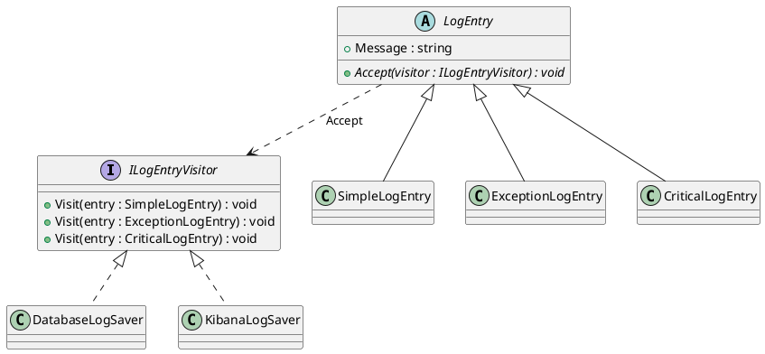
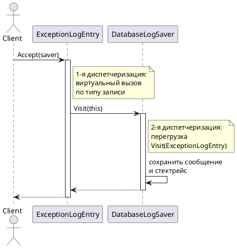

# Visitor (Посетитель)

## Уникальное название

**Visitor (Посетитель)**
Категория: поведенческий, уровень объекта.

---

## Описание решаемой проблемы

### Проблема

В LogHub есть несколько типов записей: обычная (`SimpleLogEntry`), запись об исключении
со стектрейсом (`ExceptionLogEntry`), критическая (`CriticalLogEntry`). Над ними нужно
выполнять операции: сохранить в базу, выгрузить в Kibana, посчитать статистику,
отформатировать в текст.

Первый вариант — сложить операции в сами классы записей:

```csharp
public abstract class LogEntry
{
    public abstract void SaveToDatabase();
    public abstract void SaveToKibana();
    public abstract void WriteToConsole();
    public abstract string ToPlainText();
}
```

Классы записей — простые носители данных — обрастают знанием о базе, о Kibana,
о форматировании. Каждая новая операция правит все классы иерархии.
Это нарушение SRP: у `SimpleLogEntry` появляется столько причин для изменения,
сколько существует способов её обработать.

Второй вариант — вынести операцию наружу и разобрать типы вручную:

```csharp
public void Save(LogEntry entry)
{
    if (entry is ExceptionLogEntry ex)      { SaveException(ex); }
    else if (entry is CriticalLogEntry cr)  { SaveCritical(cr); }
    else if (entry is SimpleLogEntry s)     { SaveSimple(s); }
    else throw new NotSupportedException(entry.GetType().Name);
}
```

Классы записей чистые, но:

1. **Такой `if` появляется в каждой операции.** Их четыре — значит, четыре лестницы
   проверок, которые надо править синхронно.
2. **Компилятор не помогает.** Добавили `MetricLogEntry` — программа собирается,
   а падает в рантайме на `NotSupportedException`. И только если повезёт: чаще
   новый тип молча уйдёт в ветку `else` и обработается неправильно.
3. **Порядок проверок важен.** Если `CriticalLogEntry` наследует `ExceptionLogEntry`,
   перестановка двух строк меняет поведение.

### Примеры задач

1. **LogHub.** Несколько типов записей и несколько независимых операций над ними:
   сохранение в БД, выгрузка в Kibana, подсчёт статистики (ЛР 4).
2. **Компиляторы.** Дерево разбора и операции над ним: проверка типов, оптимизация,
   генерация кода. Узлов десятки, проходов много, и проходы добавляются чаще узлов.
3. **Геометрия.** Точки в 2D и 3D и разные метрики расстояния — евклидова,
   Чебышёва, Лобачевского.

---

## Описание способа решения

Операция выносится в отдельный объект-посетитель. Каждый класс иерархии получает
единственный метод `Accept(visitor)`, который вызывает у посетителя метод для **своего**
типа. Дальше срабатывает обычная перегрузка методов.

Ключевая мысль: **вместо проверки типа снаружи — вызов изнутри.**
Объект сам знает свой тип, поэтому проверять его не нужно.

Это и называется **двойной диспетчеризацией**: конечный метод выбирается по двум типам —
типу записи и типу посетителя.

### Почему нужны именно два вызова

Виртуальный вызов в C# выбирает метод по **динамическому** типу получателя,
а перегрузку компилятор выбирает по **статическому** типу аргумента. Одной перегрузкой
задачу не решить:

```csharp
void Visit(LogEntry entry)          { Console.WriteLine("общий"); }
void Visit(ExceptionLogEntry entry) { Console.WriteLine("исключение"); }

LogEntry e = new ExceptionLogEntry();
Visit(e);   // напечатает «общий»: статический тип переменной — LogEntry
```

Метод `Accept` решает это в два хода:

```csharp
public class ExceptionLogEntry : LogEntry
{
    public override void Accept(ILogEntryVisitor visitor)
    {
        // Здесь статический тип this — ExceptionLogEntry,
        // поэтому компилятор выберет нужную перегрузку.
        visitor.Visit(this);
    }
}
```

**Первый вызов** (`entry.Accept(visitor)`) — виртуальный, выбирает по типу записи.
**Второй вызов** (`visitor.Visit(this)`) — перегрузка, выбирает по типу посетителя.

### Участники

| Роль | Класс в примере | Ответственность |
|---|---|---|
| Visitor | `ILogEntryVisitor` | Метод `Visit` на каждый тип элемента |
| ConcreteVisitor | `DatabaseLogSaver`, `KibanaLogSaver` | Конкретная операция |
| Element | `LogEntry` | Объявляет `Accept(ILogEntryVisitor)` |
| ConcreteElement | `SimpleLogEntry`, `ExceptionLogEntry` | Реализует `Accept` вызовом нужной перегрузки |
| ObjectStructure | `List<LogEntry>` | Перебирает элементы |

---

## Диаграмма и способ реализации

### Диаграмма классов



### Диаграмма последовательности



---

## Реализация на C#

### 1. Интерфейс посетителя

```csharp
public interface ILogEntryVisitor
{
    void Visit(SimpleLogEntry entry);
    void Visit(ExceptionLogEntry entry);
    void Visit(CriticalLogEntry entry);
}
```

Перегрузки, а не `VisitSimple`/`VisitException` — так короче, и разрешение
перегрузки выполняет компилятор.

### 2. Иерархия элементов

```csharp
public abstract class LogEntry
{
    public string Message { get; set; }
    public DateTime Date { get; set; }

    public abstract void Accept(ILogEntryVisitor visitor);
}

public class SimpleLogEntry : LogEntry
{
    public override void Accept(ILogEntryVisitor visitor) => visitor.Visit(this);
}

public class ExceptionLogEntry : LogEntry
{
    public Exception Exception { get; set; }

    public override void Accept(ILogEntryVisitor visitor) => visitor.Visit(this);
}
```

Тело `Accept` во всех классах выглядит одинаково — и это самая частая ошибка.
Соблазн вынести его в базовый класс велик, но так делать нельзя: в базовом классе
статический тип `this` — `LogEntry`, и вызовется общая перегрузка. **`Accept`
обязан быть переопределён в каждом конкретном классе.**

### 3. Конкретные посетители

```csharp
public class DatabaseLogSaver : ILogEntryVisitor
{
    private readonly IDbConnection _connection;

    public DatabaseLogSaver(IDbConnection connection) => _connection = connection;

    public void Visit(SimpleLogEntry entry) =>
        Insert("logs", entry.Date, entry.Message);

    public void Visit(ExceptionLogEntry entry) =>
        Insert("logs_exceptions", entry.Date, entry.Message, entry.Exception.StackTrace);

    public void Visit(CriticalLogEntry entry)
    {
        Insert("logs", entry.Date, entry.Message);
        Alert(entry);   // критические записи ещё и уведомляют дежурного
    }
}

// Вторая операция. Ни один класс записи не изменился.
public class StatisticsVisitor : ILogEntryVisitor
{
    public int Total { get; private set; }
    public int Exceptions { get; private set; }
    public int Critical { get; private set; }

    public void Visit(SimpleLogEntry entry) => Total++;
    public void Visit(ExceptionLogEntry entry) { Total++; Exceptions++; }
    public void Visit(CriticalLogEntry entry) { Total++; Critical++; }
}
```

Посетитель может накапливать состояние между вызовами — в этом его удобство:
результат обхода собирается в полях посетителя.

### 4. Клиент

```csharp
var entries = new List<LogEntry>
{
    new SimpleLogEntry { Message = "Запуск" },
    new ExceptionLogEntry { Message = "Сбой", Exception = ex },
    new CriticalLogEntry { Message = "Нет связи с БД" }
};

var stats = new StatisticsVisitor();
var saver = new DatabaseLogSaver(connection);

foreach (var entry in entries)
{
    entry.Accept(saver);
    entry.Accept(stats);
}

Console.WriteLine($"Всего {stats.Total}, из них критических {stats.Critical}");
```

### 5. Что происходит при добавлении нового типа

Появился `MetricLogEntry` — добавляем метод в `ILogEntryVisitor`.
**Все реализации посетителей перестают компилироваться**, пока не реализуют новый метод.

Это не недостаток, а важное свойство: компилятор перечислит все места,
которые нужно доработать. Сравните с `switch` по типу — там программа соберётся
и упадёт у пользователя.

Если добавлять типы всё же приходится часто, интерфейс дополняют базовым классом
с реализациями по умолчанию:

```csharp
public abstract class LogEntryVisitorBase : ILogEntryVisitor
{
    public virtual void Visit(SimpleLogEntry entry) => VisitDefault(entry);
    public virtual void Visit(ExceptionLogEntry entry) => VisitDefault(entry);
    public virtual void Visit(CriticalLogEntry entry) => VisitDefault(entry);

    protected virtual void VisitDefault(LogEntry entry) { }
}
```

Так посетители перестают ломаться при добавлении типа — но и предупреждать перестают.
Это осознанный размен, а не улучшение.

---

## Плюсы и минусы

### Плюсы

* Новая операция добавляется одним классом; иерархия элементов не меняется (OCP по операциям).
* Родственные части одной операции лежат вместе, а не размазаны по классам элементов.
* Классы элементов остаются носителями данных и не знают о БД, сети и форматировании.
* Посетитель накапливает состояние — удобно для агрегатов и отчётов.
* Компилятор заставляет обработать новый тип везде, где нужно.

### Минусы

* **Добавить тип элемента дорого:** правится интерфейс и все посетители сразу.
  Это зеркальная сторона главного плюса.
* Посетителю нужен доступ к внутренностям элемента — часть инкапсуляции теряется.
* Двойная диспетчеризация неочевидна: чтобы понять, куда попадёт вызов,
  нужно держать в голове обе стадии.
* Метод `Accept` приходится дублировать в каждом классе иерархии.

---

## Области применения

* **Компиляторы и анализаторы.** Roslyn: `CSharpSyntaxVisitor`, `CSharpSyntaxWalker` —
  синтаксическое дерево обходится посетителями.
* **Деревья выражений.** `System.Linq.Expressions.ExpressionVisitor` —
  на нём построены провайдеры LINQ.
* **Сериализация и экспорт** одной модели в несколько форматов.
* **В LogHub:** сохранение в БД, выгрузка в Kibana, подсчёт статистики (ЛР 4).

Общий признак: **иерархия типов стабильна, а операций над ней много и они добавляются.**
Если наоборот — типы растут, операции нет — Посетитель будет мешать.

---

## Сравнение с соседними паттернами

| Паттерн | Чем похож | Чем отличается |
|---|---|---|
| [Итератор](Iterator.md) | Оба проходят по структуре | Итератор даёт элементы, Посетитель выполняет над ними операцию. Часто работают вместе |
| [Компоновщик](../Структурные/Composite.md) | Посетителя обычно применяют к дереву | Компоновщик описывает структуру, Посетитель — операцию над ней |
| [Стратегия](Strategy.md) | Оба выносят поведение наружу | Стратегия — одна операция для одного типа; Посетитель — семейство операций для иерархии типов |
| [Цепочка обязанностей](ChainOfResponsibility.md) | Обе перебирают обработчики | Цепочка ищет один подходящий обработчик, Посетитель обрабатывает каждый элемент |

---

## Когда НЕ применять

* **Когда иерархия элементов растёт.** Каждый новый тип ломает всех посетителей.
  При активно меняющейся иерархии выгода отрицательная.
* **Когда операция одна.** Виртуальный метод в базовом классе решит задачу
  без интерфейсов и `Accept`.
* **Когда типов два и они не изменятся.** Сопоставление с образцом читается проще:
  ```csharp
  var text = entry switch
  {
      ExceptionLogEntry e => $"{e.Message}\n{e.Exception}",
      _                   => entry.Message
  };
  ```
* **Когда нельзя менять классы элементов.** `Accept` добавить в чужую библиотеку
  не получится — останется сопоставление с образцом.

---

## Код

Рабочий пример: [`Implementation/Behavioral/Visitor/`](../../DesignPatterns/Implementation/Behavioral/Visitor/)

```bash
dotnet run --project Implementation -- visitor
```

* `LogEntry.cs`, `SimpleLogEntry.cs`, `ExceptionLogEntry.cs` — иерархия элементов.
* `ILogEntryVisitor.cs`, `DatabaseLogSaver.cs` — интерфейс посетителя и две реализации
  (`DatabaseLogSaver`, `KibanaLogSaver`).
* `Point.cs`, `Point2D.cs`, `Point3D.cs`, `Euclid.cs`, `Chebyshev.cs` — второй пример:
  разные метрики расстояния над точками разной размерности.

---

## Вывод

Посетитель разменивает лёгкость добавления типов на лёгкость добавления операций.
Размен выгоден, когда иерархия устоялась, а операций над ней становится всё больше, —
классический случай это дерево разбора в компиляторе.

Главное в реализации — понимать, зачем нужны два вызова. Если `Accept` вынесен
в базовый класс или посетитель внутри себя проверяет типы через `is`, паттерн
не работает: получилась та же лестница `if`, только в трёх файлах вместо одного.

---

[← Оглавление учебника](../README.md)
