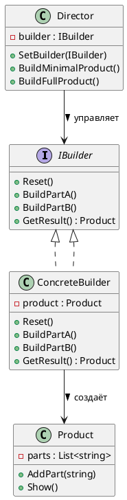
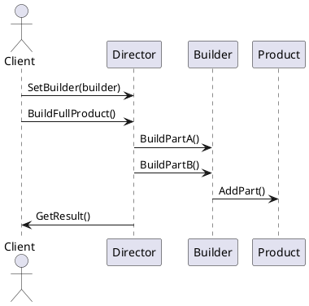
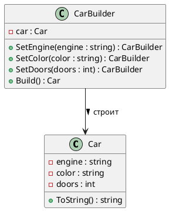

# Builder (Строитель)

## Уникальное название

**Builder (Строитель)**
Также известен как: *Пошаговый конструктор*, *Паттерн пошагового построения*.

---

## Описание решаемой проблемы

### Проблема

Иногда объект:

* имеет **много параметров** (в том числе необязательных),
* требует **сложной логики создания** или **последовательности шагов**,
* или существует **несколько различных способов построения** (вариации одного продукта).

Если использовать обычные конструкторы, код становится:

* перегруженным (`new House(4, 2, true, false, "Brick", "Tile", ...)`),
* трудночитаемым и трудно поддерживаемым,
* а добавление новых параметров вызывает каскад изменений.

📉 То есть страдает **гибкость и читаемость** кода при создании сложных объектов.

---

### Примеры задач

1. 🏠 Построение дома с множеством опций (этажи, крыша, гараж, сад и т.д.).
2. 🍔 Сборка бургера с разными ингредиентами (булка, котлета, соус, салат).
3. 🚗 Конфигурация автомобиля (тип двигателя, трансмиссия, мультимедиа).
4. 🧾 Генерация сложных отчётов (заголовки, таблицы, графики, подвал).
5. 💻 Настройка объекта конфигурации приложения с множеством параметров.

---

## Описание способа решения

Паттерн **Builder** предлагает:

* **разделить процесс построения сложного объекта на шаги**,
* **инкапсулировать эти шаги в отдельном классе — Строителе**,
* и позволить **управлять последовательностью шагов** снаружи (через *Директора*).

📘 Основная идея:

> Отделить *процесс построения объекта* от *его представления*,
> чтобы один и тот же процесс мог создавать разные представления (вариации объектов).

---

## Диаграмма и способ реализации

### UML (PlantUML) — структура классов



---

### UML (PlantUML) — последовательность сборки



---

## Пример реализации на C#

### 1. Продукт (то, что строим)

```csharp
using System;
using System.Collections.Generic;

public class House
{
    private List<string> _parts = new();

    public void AddPart(string part) => _parts.Add(part);

    public void Show()
    {
        Console.WriteLine("🏠 Дом состоит из:");
        foreach (var part in _parts)
            Console.WriteLine($" - {part}");
    }
}
```

---

### 2. Интерфейс строителя

```csharp
public interface IHouseBuilder
{
    void Reset();
    void BuildWalls();
    void BuildRoof();
    void BuildGarage();
    House GetResult();
}
```

---

### 3. Конкретные строители

```csharp
public class WoodenHouseBuilder : IHouseBuilder
{
    private House _house = new();

    public void Reset() => _house = new();

    public void BuildWalls() => _house.AddPart("Деревянные стены");
    public void BuildRoof() => _house.AddPart("Крыша из черепицы");
    public void BuildGarage() => _house.AddPart("Гараж из дерева");

    public House GetResult() => _house;
}

public class StoneHouseBuilder : IHouseBuilder
{
    private House _house = new();

    public void Reset() => _house = new();

    public void BuildWalls() => _house.AddPart("Каменные стены");
    public void BuildRoof() => _house.AddPart("Крыша из черепицы");
    public void BuildGarage() => _house.AddPart("Каменный гараж");

    public House GetResult() => _house;
}
```

---

### 4. Директор (управляет порядком сборки)

```csharp
public class Director
{
    private IHouseBuilder _builder;

    public void SetBuilder(IHouseBuilder builder)
    {
        _builder = builder;
    }

    public void BuildMinimalHouse()
    {
        _builder.Reset();
        _builder.BuildWalls();
        _builder.BuildRoof();
    }

    public void BuildFullHouse()
    {
        _builder.Reset();
        _builder.BuildWalls();
        _builder.BuildRoof();
        _builder.BuildGarage();
    }
}
```

---

### 5. Клиентский код

```csharp
public static class Program
{
    public static void Main()
    {
        var director = new Director();

        var woodenBuilder = new WoodenHouseBuilder();
        director.SetBuilder(woodenBuilder);
        director.BuildFullHouse();
        var woodenHouse = woodenBuilder.GetResult();
        woodenHouse.Show();

        Console.WriteLine();

        var stoneBuilder = new StoneHouseBuilder();
        director.SetBuilder(stoneBuilder);
        director.BuildMinimalHouse();
        var stoneHouse = stoneBuilder.GetResult();
        stoneHouse.Show();
    }
}
```

**Результат:**

```
🏠 Дом состоит из:
 - Деревянные стены
 - Крыша из черепицы
 - Гараж из дерева

🏠 Дом состоит из:
 - Каменные стены
 - Крыша из черепицы
```

---

## Плюсы и минусы

| ✅ Плюсы                                                      | ❌ Минусы                                         |
| ------------------------------------------------------------ | ------------------------------------------------ |
| Изолирует сложную логику создания                            | Добавляет больше классов                         |
| Позволяет использовать один процесс для разных представлений | Требует настройки директора                      |
| Упрощает пошаговое создание                                  | Не подходит для простых объектов                 |
| Улучшает читаемость и тестируемость                          | Может усложнить API при большом количестве шагов |

---

## Области применения

| Сфера                              | Пример                                  |
| ---------------------------------- | --------------------------------------- |
| 🏗️ Строительство сложных объектов | Дома, автомобили, отчёты                |
| 🍔 Конфигурация товаров            | Сборка заказов, бургеров, пиццы         |
| 🧾 Генерация документов            | PDF/Word отчёты с секциями              |
| 💻 Разработка UI                   | Построение сложных интерфейсов          |
| 🌐 Web API                         | Конфигурация HTTP-запросов (Fluent API) |

---

## Сравнение с другими порождающими паттернами

| Паттерн              | Основная идея                                |
| -------------------- | -------------------------------------------- |
| **[Factory Method](FactoryMethod.md)**   | Делегирует создание одного объекта подклассу |
| **[Abstract Factory](AbstractFactory.md)** | Создаёт семейства связанных объектов         |
| **[Prototype](Prototype.md)**        | Клонирует существующий объект                |
| **Builder**          | Пошагово собирает сложный объект             |

---

## Вариация: Fluent Builder (Плавный строитель)

Это не отдельный паттерн, а вариант реализации Строителя — самый распространённый в C#.

### Краткое описание

Fluent Builder — это **вариант паттерна Builder**,
в котором клиент вызывает методы строителя **цепочкой**, а не через директора.

Каждый метод возвращает ссылку на текущий объект `this`,
что позволяет удобно комбинировать шаги построения:

```csharp
var car = new CarBuilder()
    .SetEngine("V8")
    .SetColor("Красный")
    .SetDoors(2)
    .Build();
```

📌
Такой подход особенно популярен в C#, Java и TypeScript,
поскольку делает API читаемым и декларативным.

---

### Основная идея

* У каждого метода `SetXyz(...)` тип возвращаемого значения — сам строитель (`CarBuilder`).
* Методы вызываются цепочкой без промежуточных переменных.
* Не нужен отдельный объект `Director`.
* Конечный объект создаётся вызовом `Build()`.

---

### UML — Fluent Builder



---

### Пример реализации на C#

```csharp
using System;

public class Car
{
    public string Engine { get; set; }
    public string Color { get; set; }
    public int Doors { get; set; }

    public override string ToString() =>
        $"{Color} автомобиль с двигателем {Engine} и {Doors} дверями";
}

public class CarBuilder
{
    private readonly Car _car = new();

    public CarBuilder SetEngine(string engine)
    {
        _car.Engine = engine;
        return this;
    }

    public CarBuilder SetColor(string color)
    {
        _car.Color = color;
        return this;
    }

    public CarBuilder SetDoors(int doors)
    {
        _car.Doors = doors;
        return this;
    }

    public Car Build()
    {
        return _car;
    }
}

public static class Program
{
    public static void Main()
    {
        var car = new CarBuilder()
            .SetEngine("V8")
            .SetColor("Красный")
            .SetDoors(2)
            .Build();

        Console.WriteLine(car);
    }
}
```

**Вывод:**

```
Красный автомобиль с двигателем V8 и 2 дверями
```

---

### Преимущества Fluent Builder

| Преимущество               | Описание                                     |
| -------------------------- | -------------------------------------------- |
| ✨ Читаемость               | Код построения выглядит как декларация       |
| 🧩 Без директора           | Процесс сборки контролируется самим клиентом |
| 🔁 Гибкость                | Можно вызвать только нужные методы           |
| 🧱 Расширяемость           | Можно легко добавить новые шаги              |
| 💬 Удобство автодополнения | IDE подсказывает доступные шаги              |

---

### Недостатки

| Недостаток                           | Описание                                                 |
| ------------------------------------ | -------------------------------------------------------- |
| 🚫 Нет строгого порядка сборки       | Возможны ошибки, если вызвать шаги не в том порядке      |
| 🧩 Нет контроля логики               | Без директора нельзя навязать бизнес-последовательность  |
| ⚙️ Для сложных сценариев — избыточен | При сложной логике лучше классический Builder с Director |

---

### Когда использовать Fluent Builder

* Когда нужно **создавать объект с множеством опций**,
  но последовательность не критична.
* Когда важно, чтобы **код сборки был читаемым**, например:

  * при настройке конфигураций (`HttpRequestBuilder`, `QueryBuilder`, `UIBuilder`),
  * при тестировании (например, *Test Data Builders*).
* Когда вы проектируете **DSL (Domain Specific Language)** внутри кода.

---

### Fluent Builder против классического Builder

| Характеристика              | Классический Builder        | Fluent Builder        |
| --------------------------- | --------------------------- | --------------------- |
| Управление процессом        | Через `Director`            | Через клиента         |
| Контроль последовательности | Строгий                     | Гибкий                |
| Уровень абстракции          | Выше (разделяет роли)       | Ниже (один класс)     |
| Подходит для                | Сложных последовательностей | Простых конфигураций  |
| Реализация в C#             | Через интерфейсы            | Через цепочку вызовов |

---

### Пример из реальных систем

| Система                  | Реализация                                                                 |
| ------------------------ | -------------------------------------------------------------------------- |
| 🔗 `HttpClient` (C#)     | Конфигурация запроса через `HttpRequestMessage`                            |
| 🧪 `Moq` / `NSubstitute` | Настройка моков через цепочки                                              |
| 🧾 `ReportBuilder`       | Пошаговое добавление секций в отчёт                                        |
| 🎮 Game Engines          | Создание объектов через цепочки `SetPosition()`, `SetTexture()`, `Build()` |
| 🧰 Entity Framework      | Конфигурация сущностей через Fluent API (`modelBuilder.Entity<>()...`)     |

---

### Заключение

**Fluent Builder** — современный, читаемый и удобный вариант паттерна **Builder**,
который делает процесс построения:

* декларативным,
* гибким,
* и лёгким в сопровождении.

Он идеально подходит для **C#**, **Java**, **Kotlin**, **TypeScript**,
где читаемость и автодополнение — важные части API-дизайна.

---

---

## Когда НЕ применять

* **Когда у объекта два-три параметра.** Конструктор или инициализатор объекта короче и читается лучше.
* **Когда порядок шагов не важен и все поля обязательны.** Достаточно конструктора с параметрами.
* **Когда объект неизменяемый и простой.** Записи (`record`) в C# решают ту же задачу без отдельного класса.

---

---

## Код

Рабочий пример: [`Implementation/Creational/Builder/`](../../DesignPatterns/Implementation/Creational/Builder/)

```bash
dotnet run --project Implementation -- builder
```

Тестов к этому примеру пока нет — их пишут студенты в лабораторной работе.

---

---

## Вывод

**Builder (Строитель)** — мощный паттерн для **создания сложных объектов поэтапно**,
изолируя логику сборки и предоставляя разные варианты построения.

Он:

* делает код **читаемым и гибким**,
* позволяет **легко добавлять новые варианты построения**,
* и **изолирует сложность создания** от клиента.

---

[← Оглавление учебника](../README.md)
