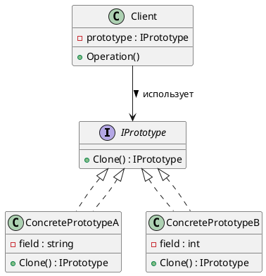
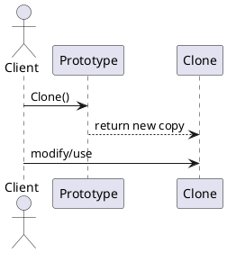
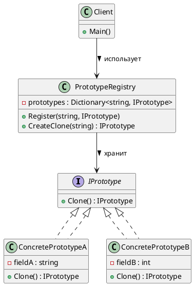

# Prototype (Прототип)

## Уникальное название

**Prototype (Прототип)**
Также известен как: *Клон*, *Шаблон объекта*.

---

## Описание решаемой проблемы

### Проблема

Необходимо **создавать новые объекты**, но их **инициализация сложна, ресурсоёмка** или **зависит от сложного состояния**.
Например, создание объекта может требовать:

* долгой загрузки данных,
* обращения к БД или сети,
* дорогостоящих вычислений.

В таких случаях выгодно **копировать уже существующий объект** (прототип),
вместо того чтобы создавать новый «с нуля».

---

### Примеры задач

1. 🎮 В игре нужно быстро создавать сотни однотипных врагов, оружия или частиц — проще клонировать базовый объект.
2. 🏗️ В графическом редакторе дублирование фигур или элементов интерфейса.
3. 💾 В приложении с документами создание новых документов на основе шаблона.
4. 🌐 В системах сериализации/десериализации — клон объекта с сохранением состояния.

---

## Описание способа решения

Идея проста:

* Вместо создания объектов через конструктор (`new`), вы создаёте **копию существующего объекта-прототипа**.
* Класс определяет метод `Clone()`, который создаёт копию текущего экземпляра.
* Клиент не заботится о том, **какой конкретный класс** клонируется.

Прототип может быть:

* **поверхностным (shallow copy)** — копируются только значения, без глубоких структур;
* **глубоким (deep copy)** — копируется всё дерево объектов.

---

## Диаграмма и способ реализации

### UML (PlantUML) — структура классов



---

### UML (PlantUML) — последовательность клонирования



---

## Реализация на C#

### 1. Интерфейс прототипа

```csharp
public interface IPrototype<T>
{
    T Clone();
}
```

---

### 2. Конкретные прототипы

```csharp
public class Circle : IPrototype<Circle>
{
    public int X { get; set; }
    public int Y { get; set; }
    public int Radius { get; set; }

    public Circle(int x, int y, int radius)
    {
        X = x;
        Y = y;
        Radius = radius;
    }

    // Поверхностное копирование
    public Circle Clone()
    {
        return (Circle)this.MemberwiseClone();
    }

    public override string ToString()
        => $"Circle: X={X}, Y={Y}, Radius={Radius}";
}

public class Rectangle : IPrototype<Rectangle>
{
    public int Width { get; set; }
    public int Height { get; set; }

    public Rectangle(int w, int h)
    {
        Width = w;
        Height = h;
    }

    public Rectangle Clone()
    {
        return (Rectangle)this.MemberwiseClone();
    }

    public override string ToString()
        => $"Rectangle: Width={Width}, Height={Height}";
}
```

---

### 3. Клиентский код

```csharp
using System;
using System.Collections.Generic;

public class PrototypeRegistry
{
    private readonly Dictionary<Type, object> _prototypes = new();

    public void Register<T>(T prototype)
    {
        _prototypes[typeof(T)] = prototype;
    }

    public T CreateClone<T>()
    {
        if (_prototypes[typeof(T)] is IPrototype<T> proto)
            return proto.Clone();
        throw new ArgumentException("Прототип не найден или несовместим");
     }
}

public static class Program
{
    public static void Main()
    {
        var registry = new PrototypeRegistry();
        registry.Register(new Circle(10, 20, 5));
        registry.Register(new Rectangle(30, 40));
        
        var circle1 = registry.CreateClone<Circle>();
        var circle2 = registry.CreateClone<Circle>();
        var rect1 = registry.CreateClone<Rectangle>();
        
        // Изменяем клон
        circle1.Radius = 15;
        
        Console.WriteLine(circle1);
        Console.WriteLine(circle2);
        Console.WriteLine(rect1);
    }
}
```

**Результат:**

```
Circle: X=10, Y=20, Radius=15
Rectangle: Width=30, Height=40
```

---

## Глубокое копирование (Deep Copy) пример

```csharp
using System.Text.Json;

public static class DeepCopyExtensions
{
    public static T DeepClone<T>(this T obj)
    {
        var json = JsonSerializer.Serialize(obj);
        return JsonSerializer.Deserialize<T>(json)!;
    }
}

// Использование:
var original = new Circle(10, 20, 5);
var deepClone = original.DeepClone();
```

---

## Плюсы и минусы, области применения, примеры

### Плюсы

| Плюс                                                 | Описание                                               |
| ---------------------------------------------------- | ------------------------------------------------------ |
| 🔹 Избавляет от повторного создания сложных объектов | Можно копировать готовые экземпляры                    |
| 🔹 Не зависит от конкретных классов                  | Клиент работает с абстракцией `Clone()`                |
| 🔹 Ускоряет создание                                 | Быстрее, чем заново вызывать конструктор с параметрами |
| 🔹 Удобно для динамического создания объектов        | Особенно, когда набор классов заранее неизвестен       |

---

### Минусы

| Минус                                 | Описание                                                             |
| ------------------------------------- | -------------------------------------------------------------------- |
| ⚙️ Сложность при глубоком копировании | Если объект содержит ссылки, их нужно клонировать вручную            |
| 🧩 Может нарушить инкапсуляцию        | Копирование приватных данных может быть проблемным                   |
| 💾 Копирование ссылок на ресурсы      | Например, открытые файлы или сокеты не могут быть просто клонированы |

---

### Области применения

* Когда создание объекта **дорого** или **трудоёмко**.
* Когда нужно **избежать зависимости от конкретных классов** при создании.
* Когда требуется **копировать существующее состояние**.
* Когда объекты хранятся в **реестре прототипов (Prototype Registry)**.

---

### Примеры из реальных систем

| Сфера                     | Пример                                                  |
| ------------------------- | ------------------------------------------------------- |
| 🎮 Игры                   | Клонирование шаблонов врагов, предметов, эффектов       |
| 🖼️ Графические редакторы | Дублирование фигур, элементов интерфейса                |
| 🧠 AI / симуляции         | Копирование агентов или нейросетевых структур           |
| 🧾 Документы              | Создание нового документа на основе шаблона             |
| 🌐 Web                    | Кэширование шаблонных объектов для ускорения рендеринга |

---

## Сравнение с другими порождающими паттернами

| Паттерн              | Назначение                                         |
| -------------------- | -------------------------------------------------- |
| **[Factory Method](FactoryMethod.md)**   | Делегирует создание объектов подклассам            |
| **[Abstract Factory](AbstractFactory.md)** | Создаёт семейства связанных объектов               |
| **[Builder](Builder.md)**          | Пошагово строит сложный объект                     |
| **Prototype**        | Копирует существующий объект без знания его класса |

---

## Вариация: Prototype Registry (Реестр прототипов)

Частое и практичное расширение Прототипа: готовые экземпляры хранятся в реестре и выдаются клиенту уже клонированными.

### Описание решаемой проблемы

### Проблема

При использовании паттерна **Prototype**, объекты-прототипы должны **где-то храниться**, чтобы можно было быстро получить нужный шаблон и склонировать его.
Если таких прототипов десятки или сотни — например, разные типы врагов, кнопок интерфейса, документов — управлять ими вручную неудобно.

📌 **Реестр прототипов** решает эту проблему, предоставляя централизованное хранилище шаблонов.

---

### Пример задач

1. 🎮 В игре — создание врагов разных типов (`Orc`, `Goblin`, `Troll`) на основе заранее зарегистрированных прототипов.
2. 🧾 В текстовом редакторе — создание новых документов на основе шаблонов (`Отчёт`, `Резюме`, `Контракт`).
3. 🖼️ В GUI — хранение стандартных элементов интерфейса для быстрого клонирования.

---

### Описание способа решения

* Создаётся **класс Registry (реестр)**, который хранит ассоциации вида
  `"ключ → прототип"`.
* Клиент запрашивает объект по ключу и получает **его клон**, а не сам прототип.
* Таким образом, можно быстро и безопасно создавать объекты нужного типа, не зная их реализацию.

📘 Реестр может быть реализован как:

* Singleton (один общий для всей программы),
* или обычный объект, передаваемый в контексте.

---

### Диаграмма и способ реализации

### UML — структура классов Prototype Registry



---

### Пример реализации на C#

```csharp
using System;
using System.Collections.Generic;

// 1️⃣ Интерфейс прототипа
public interface IPrototype
{
    IPrototype Clone();
}

// 2️⃣ Конкретные прототипы
public class Enemy : IPrototype
{
    public string Name { get; set; }
    public int Health { get; set; }
    public string Weapon { get; set; }

    public Enemy(string name, int health, string weapon)
    {
        Name = name;
        Health = health;
        Weapon = weapon;
    }

    public IPrototype Clone()
    {
        return (IPrototype)this.MemberwiseClone(); // поверхностное копирование
    }

    public override string ToString()
        => $"{Name} [HP={Health}, Weapon={Weapon}]";
}

public class Tower : IPrototype
{
    public string Type { get; set; }
    public int Damage { get; set; }

    public Tower(string type, int damage)
    {
        Type = type;
        Damage = damage;
    }

    public IPrototype Clone()
    {
        return (IPrototype)this.MemberwiseClone();
    }

    public override string ToString()
        => $"Tower Type={Type}, Damage={Damage}";
}

// 3️⃣ Реестр прототипов
public class PrototypeRegistry
{
    private readonly Dictionary<string, IPrototype> _prototypes = new();

    public void Register(string key, IPrototype prototype)
    {
        _prototypes[key] = prototype;
    }

    public IPrototype CreateClone(string key)
    {
        if (!_prototypes.ContainsKey(key))
            throw new ArgumentException($"Прототип с ключом '{key}' не найден.");

        return _prototypes[key].Clone();
    }
}

// 4️⃣ Клиентский код
public static class Program
{
    public static void Main()
    {
        var registry = new PrototypeRegistry();

        // Регистрируем базовые шаблоны
        registry.Register("orc", new Enemy("Orc", 100, "Axe"));
        registry.Register("goblin", new Enemy("Goblin", 50, "Dagger"));
        registry.Register("tower", new Tower("Defense", 80));

        // Клонируем объекты
        var orc1 = (Enemy)registry.CreateClone("orc");
        var goblin1 = (Enemy)registry.CreateClone("goblin");
        var tower1 = (Tower)registry.CreateClone("tower");

        // Изменяем клон
        orc1.Weapon = "Hammer";
        orc1.Health = 120;

        Console.WriteLine(orc1);
        Console.WriteLine(goblin1);
        Console.WriteLine(tower1);
    }
}
```

**Вывод:**

```
Orc [HP=120, Weapon=Hammer]
Goblin [HP=50, Weapon=Dagger]
Tower Type=Defense, Damage=80
```

---

### Плюсы и минусы

| ✅ Плюсы                                      | ❌ Минусы                                         |
| -------------------------------------------- | ------------------------------------------------ |
| Централизованное управление объектами        | Нужно поддерживать консистентность реестра       |
| Быстрое создание клонов                      | Возможны ошибки при копировании ссылочных данных |
| Упрощение кода клиента                       | Усложняет архитектуру, если прототипов немного   |
| Гибкость — можно подменять прототипы на лету | При глубоком копировании — больше кода           |

---

### Области применения

* Игровые движки — для хранения шаблонов врагов, предметов, объектов мира.
* Редакторы и IDE — шаблоны документов, окон, панелей.
* Конфигурационные системы — сохранение и клонирование заранее настроенных профилей.
* Инжиниринговые приложения — хранение типовых узлов, деталей или модулей.

---

### Пример расширения: Singleton + Registry

Можно сделать **глобальный реестр прототипов** в виде Singleton:

```csharp
public sealed class GlobalPrototypeRegistry : PrototypeRegistry
{
    private static readonly Lazy<GlobalPrototypeRegistry> _instance =
        new(() => new GlobalPrototypeRegistry());

    public static GlobalPrototypeRegistry Instance => _instance.Value;

    private GlobalPrototypeRegistry() { }
}
```

Использование:

```csharp
GlobalPrototypeRegistry.Instance.Register("orc", new Enemy("Orc", 100, "Axe"));
var clone = GlobalPrototypeRegistry.Instance.CreateClone("orc");
```

---

### Когда использовать Prototype Registry

| Признак                                 | Почему подходит                                  |
| --------------------------------------- | ------------------------------------------------ |
| 🔁 Частое создание однотипных объектов  | Ускоряет создание                                |
| 📦 Есть ограниченный набор шаблонов     | Централизованное хранение                        |
| 🧱 Важно состояние объектов             | Позволяет создавать объекты с готовым состоянием |
| 🧩 Нужно изолировать клиента от классов | Клиент работает только с ключами и интерфейсом   |

---

### Вывод

**Prototype Registry** — это надстройка над паттерном **Prototype**,
которая позволяет удобно **управлять множеством шаблонов** через централизованный реестр.

📌 Этот паттерн часто используется в:

* игровых движках,
* системах шаблонов,
* фабриках UI-компонентов.

Он повышает **гибкость**, **скорость создания объектов** и **модульность кода**.

---

---

## Когда НЕ применять

* **Когда создание объекта дёшево.** Клонирование окупается только если конструирование дорогое —
  запрос к БД, разбор файла, тяжёлые вычисления.
* **Когда объект владеет внешними ресурсами.** Соединение, файловый дескриптор, поток нельзя просто скопировать.
* **Когда граф ссылок сложный и циклический.** Глубокое копирование в этом случае само по себе
  превращается в источник ошибок.

---

---

## Код

Рабочий пример: [`Implementation/Creational/Prototype/`](../../DesignPatterns/Implementation/Creational/Prototype/)

```bash
dotnet run --project Implementation -- prototype
```

Тестов к этому примеру пока нет — их пишут студенты в лабораторной работе.

---

---

## Вывод

**Prototype (Прототип)** — удобный паттерн для случаев, когда:

* создание объектов трудоёмкое,
* классы неизвестны на этапе компиляции,
* или объекты нужно часто копировать с разными изменениями.

Он помогает **избежать зависимостей от конкретных типов** и **ускоряет создание экземпляров**,
но требует аккуратности при **глубоком копировании** и работе со сложными ссылками.

---

[← Оглавление учебника](../README.md)
