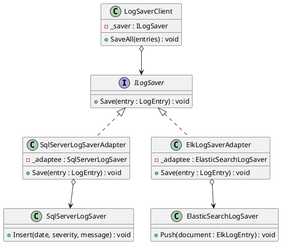
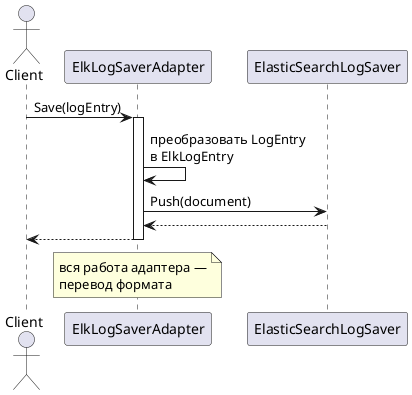

# Adapter (Адаптер)

## Уникальное название

**Adapter (Адаптер)**
Также известен как: *Wrapper* (обёртка).
Категория: структурный. Существует в двух вариантах: адаптер класса (уровень класса)
и адаптер объекта (уровень объекта).

---

## Описание решаемой проблемы

### Проблема

LogHub умеет писать записи в приёмники через единый интерфейс:

```csharp
public interface ILogSaver
{
    void Save(LogEntry entry);
}
```

Появляется требование складывать логи в SQL Server. Библиотека для этого уже есть,
но её API устроен иначе:

```csharp
internal class SqlServerLogSaver
{
    public void Insert(DateTime date, int severityCode, string message) { ... }
}
```

И ещё одна — для Elasticsearch, где запись передаётся документом:

```csharp
internal class ElasticSearchLogSaver
{
    public void Push(ElkLogEntry document) { ... }
}
```

Ни один из этих классов не реализует `ILogSaver` и никогда не будет:
их писали не мы, изменить их нельзя. Прямолинейные решения плохи все:

1. **Ветвление в клиенте.** `if (saver is SqlServerLogSaver sql) sql.Insert(...)` —
   возвращается тот самый `switch` по типу, от которого уходили в Стратегии,
   и клиент начинает знать обо всех библиотеках сразу.
2. **Правка чужого кода.** Библиотека внешняя; при обновлении версии правки исчезнут.
3. **Смена собственного интерфейса под чужой.** `ILogSaver` пришлось бы свести
   к наименьшему общему знаменателю всех библиотек — он станет неудобным
   и всё равно не подойдёт следующей.

### Примеры задач

1. **LogHub.** Подключение SQL Server и Elasticsearch к общему `ILogSaver` (ЛР 5).
2. **Замена библиотеки.** Код завязан на один HTTP-клиент, нужно перейти на другой.
   Адаптер над новым клиентом с интерфейсом старого делает переход незаметным.
3. **Legacy-код.** Старый модуль возвращает `DataTable`, новый ожидает `IEnumerable<T>`.

---

## Описание способа решения

Пишется класс-переходник, который реализует **нужный** интерфейс, а внутри вызывает
**чужой** объект, переводя вызовы и данные из одного формата в другой.

Ключевая мысль: **адаптер не добавляет и не убирает поведение — он меняет форму вызова.**
Если внутри появляется логика, которой не было ни в одной из сторон, это уже не адаптер.

### Два вида адаптера

**Адаптер объекта** — адаптируемый объект хранится полем (композиция):

```csharp
public class SqlServerLogSaverAdapter : ILogSaver
{
    private readonly SqlServerLogSaver _saver;   // композиция
}
```

**Адаптер класса** — адаптер наследуется от адаптируемого класса:

```csharp
public class SqlServerLogSaverAdapter : SqlServerLogSaver, ILogSaver
```

В C# второй вариант применим редко: множественного наследования классов нет,
поэтому адаптировать так можно только один класс, и он не должен быть `sealed`
(а большинство библиотечных классов именно `sealed` или `internal`).

| | Адаптер объекта | Адаптер класса |
|---|---|---|
| Механизм | Композиция | Наследование |
| Сколько объектов адаптирует | Любое количество | Ровно один |
| Работает с иерархией адаптируемого | Да, через полиморфизм | Нет, тип фиксирован |
| Можно подменить адаптируемый объект в рантайме | Да | Нет |
| Доступ к `protected`-членам | Нет | Да |
| Применимость в C# | Практически всегда | Редко |

Практическое правило: **берите адаптер объекта**, если нет конкретной причины
для наследования.

### Участники

| Роль | Класс в примере | Ответственность |
|---|---|---|
| Target | `ILogSaver` | Интерфейс, который ожидает клиент |
| Adaptee | `SqlServerLogSaver`, `ElasticSearchLogSaver` | Существующий класс с неподходящим API |
| Adapter | `SqlServerLogSaverAdapter`, `ElkLogSaverAdapter` | Реализует Target, вызывает Adaptee |
| Client | `LogSaverClient` | Работает только с Target |

---

## Диаграмма и способ реализации

### Диаграмма классов



### Диаграмма последовательности



---

## Реализация на C#

### 1. Целевой интерфейс и клиент

```csharp
public interface ILogSaver
{
    void Save(LogEntry entry);
}

public class LogSaverClient
{
    private readonly ILogSaver _saver;

    public LogSaverClient(ILogSaver saver) => _saver = saver;

    public void SaveAll(IEnumerable<LogEntry> entries)
    {
        foreach (var entry in entries)
        {
            _saver.Save(entry);
        }
    }
}
```

Клиент не изменится никогда — сколько бы приёмников ни добавилось.

### 2. Адаптер объекта: SQL Server

```csharp
public class SqlServerLogSaverAdapter : ILogSaver
{
    private readonly SqlServerLogSaver _adaptee;

    public SqlServerLogSaverAdapter(SqlServerLogSaver adaptee)
    {
        _adaptee = adaptee ?? throw new ArgumentNullException(nameof(adaptee));
    }

    public void Save(LogEntry entry)
    {
        // Единственная работа: разложить объект на параметры чужого метода.
        _adaptee.Insert(entry.Date, (int)entry.Severity, entry.Message);
    }
}
```

### 3. Адаптер объекта: Elasticsearch

```csharp
public class ElkLogSaverAdapter : ILogSaver
{
    private readonly ElasticSearchLogSaver _adaptee;

    public ElkLogSaverAdapter(ElasticSearchLogSaver adaptee) => _adaptee = adaptee;

    public void Save(LogEntry entry)
    {
        // Здесь перевод данных сложнее: чужому API нужен документ.
        var document = new ElkLogEntry
        {
            Timestamp = entry.Date.ToUniversalTime(),
            Level = entry.Severity.ToString().ToLowerInvariant(),
            Message = entry.Message,
            Index = $"logs-{entry.Date:yyyy.MM.dd}"
        };

        _adaptee.Push(document);
    }
}
```

Обратите внимание: правило формирования имени индекса — это уже маленькое решение,
принятое адаптером. Такое допустимо: оно относится к формату целевой системы.
А вот фильтрация записей по важности внутри `Save` была бы ошибкой —
это поведение, а не перевод формата.

### 4. Адаптер класса

```csharp
// Работает, только если SqlServerLogSaver не sealed и доступен извне сборки.
public class SqlServerLogSaverClassAdapter : SqlServerLogSaver, ILogSaver
{
    public void Save(LogEntry entry) =>
        Insert(entry.Date, (int)entry.Severity, entry.Message);
}
```

Короче на одно поле и конструктор, но адаптер намертво привязан к типу
и наследует весь его публичный API, включая то, что клиенту видеть незачем.

### 5. Клиент не различает адаптеры

```csharp
var savers = new List<ILogSaver>
{
    new SqlServerLogSaverAdapter(new SqlServerLogSaver(connectionString)),
    new ElkLogSaverAdapter(new ElasticSearchLogSaver(elkUrl))
};

foreach (var saver in savers)
{
    new LogSaverClient(saver).SaveAll(entries);
}
```

### Двусторонний адаптер

Иногда нужно, чтобы объект работал в обеих системах. Тогда адаптер реализует
оба интерфейса сразу:

```csharp
public class TwoWayAdapter : ILogSaver, ILegacyLogWriter { ... }
```

Приём встречается редко и легко превращается в свалку — применяйте осознанно.

---

## Плюсы и минусы

### Плюсы

* Позволяет использовать классы с несовместимым API, не меняя ни их, ни клиента.
* Клиент отвязан от конкретной библиотеки — заменить её можно, переписав один адаптер.
* Перевод формата собран в одном месте, а не размазан по коду.
* Адаптер легко тестируется: подставляется мок адаптируемого объекта,
  проверяется корректность перевода.
* Соблюдает SRP: перевод формата — отдельная обязанность отдельного класса.

### Минусы

* Появляются дополнительные классы: на каждую внешнюю библиотеку по адаптеру.
* Лишний уровень косвенности; в горячем коде это заметно.
* Если интерфейсы расходятся сильно, адаптер разрастается и становится
  самостоятельным источником ошибок.
* Соблазн «дописать чуть-чуть логики» в адаптер очень велик — и это самая
  частая ошибка при его использовании.

---

## Области применения

* **В .NET:** `TextReader`/`StreamReader` над разными источниками,
  `IDataReader` над разными провайдерами БД, обёртки над HTTP-клиентами,
  `Microsoft.Extensions.Logging` — адаптеры к Serilog, NLog, log4net.
* **Интеграции.** Подключение сторонних платёжных систем, почтовых сервисов,
  хранилищ к единому внутреннему интерфейсу.
* **В LogHub:** приёмники SQL Server и Elasticsearch под общим `ILogSaver` (ЛР 5).

---

## Сравнение с соседними паттернами

Четыре структурных паттерна выглядят почти одинаково — все оборачивают объект
и реализуют интерфейс. Различает их намерение:

| Паттерн | Интерфейс результата | Зачем |
|---|---|---|
| **Адаптер** | **Другой**, чем у обёрнутого | Совместить несовместимое |
| [Декоратор](Decorator.md) | Тот же | Добавить поведение; складывается стопкой |
| [Заместитель](Proxy.md) | Тот же | Контролировать доступ; обычно один |
| [Фасад](Facade.md) | Новый, упрощённый | Спрятать сложность целой подсистемы |

Быстрая проверка: **если интерфейс на входе и выходе одинаковый — это не адаптер.**

---

## Когда НЕ применять

* **Когда интерфейс можно изменить.** Если обе стороны ваши, проще привести их
  к общему виду, чем содержать переходник.
* **Когда адаптеру нужна собственная логика.** Фильтрация, повторы, кэширование
  внутри `Save` — это [Декоратор](Decorator.md) или [Заместитель](Proxy.md),
  а не адаптер. Смешивать их — верный способ получить класс, который никто
  не сможет описать одним предложением.
* **Когда адаптируется целая подсистема из десятка классов.** Один класс
  с двадцатью методами — это [Фасад](Facade.md).
* **Когда различие только в именах методов и вызов один.** Иногда честнее
  вызвать чужой метод напрямую, чем заводить класс ради одной строки.

---

## Код

Рабочий пример: [`Implementation/Structural/Adapter/`](../../DesignPatterns/Implementation/Structural/Adapter/)

```bash
dotnet run --project Implementation -- adapter
```

* `ILogSaver.cs` — целевой интерфейс.
* `SqlServerLogSaver.cs`, `ElasticSearchLogSaver.cs` — «чужие» классы с неподходящим API.
* `SqlServerLogSaverAdapter.cs`, `ElkLogSaverAdapter.cs` — адаптеры объекта.
* `LogSaverClient.cs` — клиент, который знает только `ILogSaver`.

---

## Вывод

Адаптер — самый простой паттерн из структурных и один из самых частых на практике:
любая интеграция со сторонней библиотекой рано или поздно приводит к нему.

Его легко применить и так же легко испортить. Единственное правило, которое нужно
удерживать: **адаптер переводит форму вызова и ничего больше.** Как только внутри
появляется решение, которого не было ни у клиента, ни у библиотеки, класс перестаёт
быть адаптером — и его надо разделить.

---

[← Оглавление учебника](../README.md)
