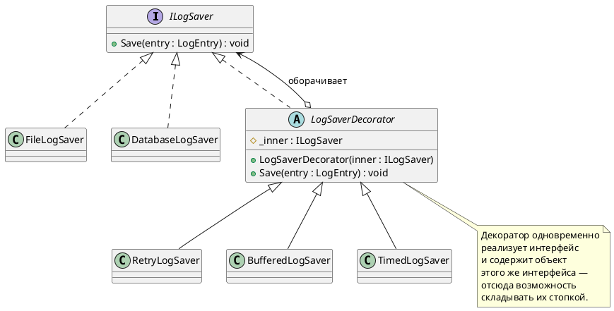
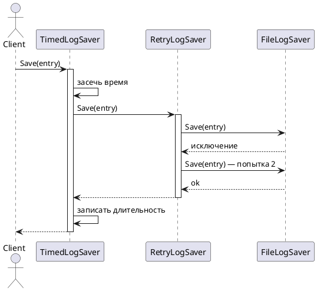

# Decorator (Декоратор)

## Уникальное название

**Decorator (Декоратор)**
Также известен как: *Wrapper* (обёртка).
Категория: структурный, уровень объекта.

---

## Описание решаемой проблемы

### Проблема

У LogHub есть приёмники записей — консоль, файл, база данных:

```csharp
public interface ILogSaver
{
    void Save(LogEntry entry);
}
```

Со временем к ним появляются сквозные требования. Запись в БД может упасть —
нужен повтор. Запись по одной медленная — нужна буферизация. Непонятно,
какой приёмник тормозит, — нужен замер времени.

Решение наследованием разваливается сразу:

```
FileLogSaver
FileLogSaverWithRetry
FileLogSaverWithBuffer
FileLogSaverWithRetryAndBuffer
FileLogSaverWithRetryAndBufferAndTiming
DatabaseLogSaverWithRetry
DatabaseLogSaverWithRetryAndBuffer
...
```

Три приёмника и три возможности дают 3 × 2³ = 24 класса. Четвёртая возможность —
48. Причём:

1. **Комбинации нельзя выбрать в рантайме.** Тип фиксируется при компиляции;
   включить повторы по настройке не получится.
2. **Порядок не выразить.** «Буферизация поверх повторов» и «повторы поверх буферизации»
   ведут себя по-разному, а имя класса это не передаёт.
3. **Код возможностей дублируется** в каждом сочетании.

Второй вариант — свалить всё в один класс с флагами:

```csharp
public class FileLogSaver : ILogSaver
{
    public bool UseRetry { get; set; }
    public bool UseBuffer { get; set; }
    public bool MeasureTime { get; set; }

    public void Save(LogEntry entry)
    {
        if (MeasureTime) { /* ... */ }
        if (UseBuffer) { /* ... */ }
        if (UseRetry) { /* ... */ }
    }
}
```

Классов больше не плодится, но класс превращается в клубок флагов, где
каждая новая возможность правит существующий код — нарушение OCP,
и порядок применения по-прежнему зашит намертво.

### Примеры задач

1. **LogHub.** Обвес приёмника замером времени, повторами и буферизацией
   в любых сочетаниях (ЛР 5).
2. **Потоки в .NET.** `GZipStream`, `BufferedStream`, `CryptoStream` —
   каждый оборачивает другой поток и добавляет своё.
3. **Middleware в ASP.NET Core.** Каждый компонент оборачивает следующий,
   порядок задаётся в `Startup`.

---

## Описание способа решения

Возможность оформляется отдельным классом, который **реализует тот же интерфейс**,
что и оборачиваемый объект, хранит ссылку на него и делает свою работу
до, после или вокруг делегированного вызова.

Ключевая мысль: **декоратор подменяет объект, оставаясь для клиента тем же самым.**
Именно поэтому декораторы складываются друг в друга без ограничений —
результат обёртки снова годится на вход следующей.

Число комбинаций из проблемы никуда не делось, но теперь их не нужно
описывать классами: комбинация собирается выражением.

### Участники

| Роль | Класс в примере | Ответственность |
|---|---|---|
| Component | `ILogSaver` | Общий интерфейс |
| ConcreteComponent | `FileLogSaver`, `DatabaseLogSaver` | Базовое поведение |
| Decorator | `LogSaverDecorator` | Абстрактный базовый декоратор: хранит ссылку и делегирует |
| ConcreteDecorator | `RetryLogSaver`, `BufferedLogSaver`, `TimedLogSaver` | Добавляет своё поведение |

---

## Диаграмма и способ реализации

### Диаграмма классов



### Диаграмма последовательности



Здесь виден смысл порядка: замер времени снаружи учитывает все попытки повтора.
Если поменять декораторы местами, время будет считаться по каждой попытке отдельно.

---

## Реализация на C#

### 1. Базовый декоратор

```csharp
public abstract class LogSaverDecorator : ILogSaver
{
    protected readonly ILogSaver Inner;

    protected LogSaverDecorator(ILogSaver inner)
    {
        Inner = inner ?? throw new ArgumentNullException(nameof(inner));
    }

    public virtual void Save(LogEntry entry) => Inner.Save(entry);
}
```

Базовый класс не обязателен, но избавляет от дублирования: без него каждый декоратор
сам хранил бы поле и делегировал все методы интерфейса.

### 2. Конкретные декораторы

```csharp
public class RetryLogSaver : LogSaverDecorator
{
    private readonly int _attempts;

    public RetryLogSaver(ILogSaver inner, int attempts = 3) : base(inner)
        => _attempts = attempts;

    public override void Save(LogEntry entry)
    {
        for (var attempt = 1; ; attempt++)
        {
            try
            {
                Inner.Save(entry);
                return;
            }
            catch (IOException) when (attempt < _attempts)
            {
                Thread.Sleep(100 * attempt);
            }
        }
    }
}

public class TimedLogSaver : LogSaverDecorator
{
    private readonly Action<TimeSpan> _report;

    public TimedLogSaver(ILogSaver inner, Action<TimeSpan> report) : base(inner)
        => _report = report;

    public override void Save(LogEntry entry)
    {
        var sw = Stopwatch.StartNew();
        Inner.Save(entry);          // работа «вокруг» вызова
        sw.Stop();
        _report(sw.Elapsed);
    }
}

public class BufferedLogSaver : LogSaverDecorator, IDisposable
{
    private readonly List<LogEntry> _buffer = new List<LogEntry>();
    private readonly int _size;

    public BufferedLogSaver(ILogSaver inner, int size = 100) : base(inner) => _size = size;

    public override void Save(LogEntry entry)
    {
        _buffer.Add(entry);

        if (_buffer.Count >= _size)
        {
            Flush();
        }
    }

    public void Flush()
    {
        foreach (var entry in _buffer)
        {
            Inner.Save(entry);
        }

        _buffer.Clear();
    }

    // Декоратор с состоянием обязан уметь освобождаться,
    // иначе последняя, неполная порция записей потеряется.
    public void Dispose()
    {
        Flush();
        (Inner as IDisposable)?.Dispose();
    }
}
```

### 3. Сборка стопки

```csharp
ILogSaver saver = new FileLogSaver("app.log");

if (config.Retry)  { saver = new RetryLogSaver(saver, attempts: 3); }
if (config.Buffer) { saver = new BufferedLogSaver(saver, size: 100); }
if (config.Timing) { saver = new TimedLogSaver(saver, t => metrics.Record(t)); }

client.SaveAll(entries);   // клиент по-прежнему видит просто ILogSaver
```

Состав и порядок задаются конфигурацией, ни одного нового класса на комбинацию.

### 4. Порядок имеет значение

```csharp
// Повторы снаружи буфера: при сбое повторяется сброс всей порции.
new RetryLogSaver(new BufferedLogSaver(new FileLogSaver(path)));

// Буфер снаружи повторов: повторяется запись каждой отдельной записи.
new BufferedLogSaver(new RetryLogSaver(new FileLogSaver(path)));
```

Оба варианта корректны и делают разное. В отчёте по лабораторной работе
это различие нужно уметь объяснить.

### Типичные ошибки

* **Декоратор не реализует интерфейс, а наследует конкретный класс.**
  Тогда его нельзя обернуть вокруг другой реализации — паттерн сломан.
* **Декоратор меняет контракт.** Если `Save` в декораторе может молча не сохранить
  запись, клиент об этом не знает — нарушение LSP.
* **Декоратор с состоянием без `Dispose`.** Буфер, который никто не сбросил,
  теряет данные.
* **Слишком глубокая стопка.** Семь декораторов подряд отлаживать невозможно:
  в стеке вызовов семь одинаковых `Save`.

---

## Плюсы и минусы

### Плюсы

* Возможности комбинируются в рантайме, число классов растёт линейно, а не степенью.
* Каждая возможность живёт в своём классе и тестируется отдельно.
* Новая возможность — новый класс, существующий код не меняется (OCP).
* Клиент ничего не знает об обвесе: интерфейс тот же.
* Гибкая альтернатива наследованию — можно снять возможность так же легко, как добавить.

### Минусы

* Стек вызовов становится длинным и однообразным, отладка усложняется.
* Убрать декоратор из середины собранной стопки нельзя — надо пересобирать.
* Поведение зависит от порядка, а порядок нигде не задокументирован, кроме кода сборки.
* Декоратор нельзя отличить от оборачиваемого объекта по типу — а иногда это нужно.
* Много маленьких объектов: в горячем коде заметны и аллокации, и цепочка вызовов.

---

## Области применения

* **В .NET:** `Stream` и его декораторы (`BufferedStream`, `GZipStream`, `CryptoStream`),
  middleware в ASP.NET Core, `DelegatingHandler` в `HttpClient`,
  политики Polly (повторы, таймауты, circuit breaker).
* **В LogHub:** обвес приёмников повторами, буферизацией, замером времени (ЛР 5).

---

## Сравнение с соседними паттернами

| Паттерн | Интерфейс результата | Зачем | Сколько обычно |
|---|---|---|---|
| **Декоратор** | Тот же | Добавить поведение | Несколько, стопкой |
| [Адаптер](Adapter.md) | Другой | Совместить несовместимое | Один |
| [Заместитель](Proxy.md) | Тот же | Контролировать доступ | Один |
| [Стратегия](../Поведенческие/Strategy.md) | — | Заменить поведение целиком | Одна активная |

**Декоратор против Заместителя** — самая частая путаница. Код у них похож до неразличимости,
разница в намерении и в способе создания: декоратор получает готовый объект снаружи
и добавляет к нему поведение, заместитель обычно сам управляет жизненным циклом
подопечного и решает, вызывать его или нет.

---

## Когда НЕ применять

* **Когда возможность одна и она нужна всегда.** Проще вписать её в сам класс.
* **Когда декораторов больше трёх-четырёх.** Отладка становится мучением;
  подумайте о конвейере с явным списком шагов — он хотя бы виден целиком.
* **Когда декоратор должен знать о других декораторах.** Это признак,
  что нужен не декоратор, а [Посредник](../Поведенческие/Mediator.md) или конвейер.
* **Когда интерфейс широкий.** Декоратор к интерфейсу с пятнадцатью методами
  вынужден делегировать все пятнадцать — сначала разделите интерфейс (ISP).
* **Когда меняется не поведение, а форма вызова.** Это [Адаптер](Adapter.md).

---

## Код

Рабочий пример: [`Implementation/Structural/Decorator/`](../../DesignPatterns/Implementation/Structural/Decorator/)

```bash
dotnet run --project Implementation -- decorator
```

`Decorator.cs` — пример на другой предметной области: базовый велосипед
(`AluminiumBike`, `CarbonBike`) обрастает пакетами опций (`SecurityPackage`,
`SportPackage`), которые складываются в любом количестве и порядке,
а цена и описание накапливаются по стопке.

Там же метод `BikeShop.StreamTest()` показывает ту же идею на стандартной
библиотеке: `MemoryStream` → `GZipStream` → `BufferedStream` → `CryptoStream`.

---

## Вывод

Декоратор нужен там, где к базовому поведению добавляются независимые возможности,
которые хочется включать по отдельности и в разных сочетаниях. Он превращает
комбинаторный взрыв классов в одну строчку сборки.

Признак правильного применения: снять любой декоратор из стопки можно,
не тронув остальные, и клиент этого не заметит. Если декораторы начинают
зависеть друг от друга или от порядка неявно — паттерн уже не помогает.

---

[← Оглавление учебника](../README.md)
