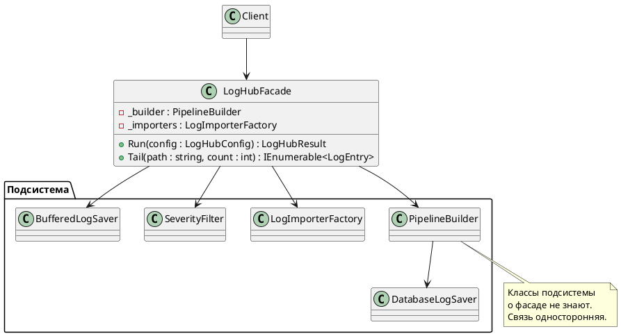
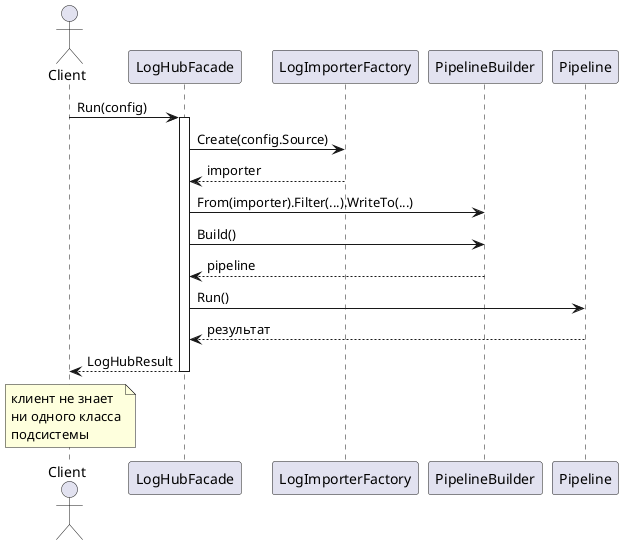

# Facade (Фасад)

## Уникальное название

**Facade (Фасад)**
Категория: структурный, уровень объекта.

---

## Описание решаемой проблемы

### Проблема

К концу курса LogHub состоит из полутора десятков классов: импортёры, фабрики,
строитель конвейера, фильтры, посетители, приёмники с адаптерами и декораторами.
Чтобы просто прочитать файл и вывести записи в консоль, клиенту приходится
собрать всю конструкцию вручную:

```csharp
var config = ConfigurationLoader.Load("loghub.json");
var factory = new ProductionComponentFactory(config);

var importer = new LogImporterFactory(config).Create(config.Source);
var reader = new FileLogReader(config.Path);

var filters = new SeverityFilter(config.MinSeverity);
filters.SetNext(new AgeFilter(config.MaxAge))
       .SetNext(new DuplicateFilter());

ILogSaver saver = new LazyDatabaseLogSaver(() => new DatabaseLogSaver(config.ConnectionString));
saver = new RetryLogSaver(saver, config.Attempts);
saver = new BufferedLogSaver(saver, config.BufferSize);

var pipeline = new PipelineBuilder()
    .From(importer)
    .Filter(filters)
    .WriteTo(saver)
    .Build();

pipeline.Run();
```

Двадцать строк, восемь `using` внутренних пространств имён и знание того,
в каком порядке всё это собирается. Последствия:

1. **Клиент знает о внутреннем устройстве системы.** Переименовали класс фильтра —
   сломались все, кто пользуется библиотекой.
2. **Порядок сборки нигде не зафиксирован.** Забыть `SetNext` или собрать
   декораторы в неправильном порядке ничто не мешает.
3. **Код сборки копируется.** Он повторяется в приложении, в тестах, в утилите
   командной строки — и расходится между ними.
4. **Порог входа высокий.** Чтобы решить типовую задачу, нужно разобраться
   во всей архитектуре.

### Примеры задач

1. **LogHub.** Одна точка входа `LogHub.Run(config)` вместо ручной сборки конвейера (ЛР 5).
2. **Конвертация видео.** Внутри — десятки классов кодеков, аудиодорожек, контейнеров;
   наружу — метод `Convert(file, format)`.
3. **`HttpClient` в .NET.** За `GetStringAsync` скрыты обработчики, пулы соединений,
   сокеты и парсеры заголовков.

---

## Описание способа решения

Создаётся класс с простым интерфейсом, который берёт на себя сборку и координацию
подсистемы. Клиент обращается к нему; о существовании внутренних классов
он не знает.

Ключевая мысль: **фасад описывает не всю подсистему, а типовые сценарии её использования.**
Он не обязан открывать все возможности — наоборот, его ценность в том, что он
показывает малую их часть.

Важное отличие от других обёрток: фасад **односторонний**. Классы подсистемы
о нём не знают и никогда к нему не обращаются. И он не запрещает работать
с подсистемой напрямую — если типового сценария не хватает, продвинутый клиент
собирает всё сам.

### Участники

| Роль | Класс в примере | Ответственность |
|---|---|---|
| Facade | `LogHubFacade` | Простой интерфейс, знает, как собрать подсистему |
| Subsystem | `PipelineBuilder`, `LogImporterFactory`, фильтры, приёмники | Делают настоящую работу, о фасаде не знают |
| Client | `Program` | Обращается только к фасаду |

---

## Диаграмма и способ реализации

### Диаграмма классов



### Диаграмма последовательности



---

## Реализация на C#

### 1. Фасад

```csharp
public class LogHubFacade
{
    private readonly LogImporterFactory _importers;
    private readonly ILogSinkFactory _sinks;

    public LogHubFacade(LogImporterFactory importers, ILogSinkFactory sinks)
    {
        _importers = importers;
        _sinks = sinks;
    }

    /// <summary>Типовой сценарий: прочитать источник и разложить по приёмникам.</summary>
    public LogHubResult Run(LogHubConfig config)
    {
        var importer = _importers.Create(config.Source);
        var filters = BuildFilters(config);
        var sink = BuildSink(config);

        var pipeline = new PipelineBuilder()
            .From(importer)
            .Filter(filters)
            .WriteTo(sink)
            .Build();

        return pipeline.Run();
    }

    /// <summary>Второй типовой сценарий: показать последние N записей.</summary>
    public IEnumerable<LogEntry> Tail(string path, int count = 20) =>
        new FileLogReader(path).ReadLogEntry().TakeLast(count);

    private static ILogFilter BuildFilters(LogHubConfig config)
    {
        var first = new SeverityFilter(config.MinSeverity);
        first.SetNext(new AgeFilter(config.MaxAge))
             .SetNext(new DuplicateFilter());
        return first;
    }

    private ILogSaver BuildSink(LogHubConfig config)
    {
        var sink = _sinks.Create(config.Sink);

        if (config.Retry)  { sink = new RetryLogSaver(sink, config.Attempts); }
        if (config.Buffer) { sink = new BufferedLogSaver(sink, config.BufferSize); }

        return sink;
    }
}
```

Порядок сборки декораторов и цепочки фильтров зафиксирован в одном месте
и больше не может быть нарушен по невнимательности.

### 2. Клиент

```csharp
var hub = new LogHubFacade(importerFactory, sinkFactory);
var result = hub.Run(LogHubConfig.FromFile("loghub.json"));

Console.WriteLine($"Обработано {result.Processed}, отброшено {result.Filtered}");
```

Пять строк вместо двадцати, ни одного `using` внутренних пространств имён.
Именно это и проверяется в лабораторной работе 5.

### 3. Прямой доступ остаётся

```csharp
// Нестандартный сценарий: фасад не мешает собрать конвейер вручную.
var custom = new PipelineBuilder()
    .From(new InMemoryLogImporter(entries))
    .Filter(new SeverityFilter(LogSeverity.Critical))
    .WriteTo(new ConsoleLogSaver())
    .Build();
```

Фасад — удобство, а не запрет. Если он единственный способ добраться
до подсистемы, вы построили не фасад, а границу модуля — это тоже бывает нужно,
но называется иначе.

### Как не превратить фасад в god-объект

Главная опасность паттерна: фасад растёт, вбирает в себя логику подсистемы
и превращается в тот самый божественный объект, с которым боролись.

Признаки, что это уже произошло:

* **Больше десяти публичных методов.** Значит, «типовых сценариев» стало
  слишком много — делите фасад по областям (`LogHubImport`, `LogHubQuery`).
* **В фасаде появились вычисления.** Разбор строки, подсчёт статистики,
  форматирование — это работа подсистемы, фасад только координирует.
* **Фасад хранит изменяемое состояние между вызовами.** Он должен быть
  как можно ближе к безсостоянийному.
* **Классы подсистемы начали ссылаться на фасад.** Односторонность нарушена,
  получился [Посредник](../Поведенческие/Mediator.md).

---

## Плюсы и минусы

### Плюсы

* Клиент отвязан от внутреннего устройства подсистемы: её можно перестраивать свободно.
* Порог входа резко падает — типовая задача решается одним вызовом.
* Порядок сборки зафиксирован в одном месте и не дублируется.
* Уменьшается связность между слоями приложения.
* Не запрещает прямой доступ: нестандартные сценарии по-прежнему возможны.

### Минусы

* **Риск god-объекта** — главный. Фасад притягивает к себе логику.
* Ещё один класс, который надо поддерживать при каждом изменении подсистемы.
* Может скрыть возможности, которые клиенту нужны, — и тогда его начинают обходить.
* Прячет стоимость операции: за одной строкой `Run(config)` может стоять
  открытие соединений и чтение гигабайта.

---

## Области применения

* **В .NET:** `HttpClient` над обработчиками и сокетами; `File.ReadAllLines`
  над потоками и кодировками; `WebApplicationBuilder` в ASP.NET Core;
  `DbContext` над провайдером, трекером изменений и транслятором запросов.
* **Границы модулей.** Публичный API библиотеки почти всегда фасад
  над её внутренним устройством.
* **В LogHub:** точка входа `LogHub.Run(config)` (ЛР 5).

---

## Сравнение с соседними паттернами

| Паттерн | Что оборачивает | Интерфейс результата | Направление связи |
|---|---|---|---|
| **Фасад** | Целую подсистему | Новый, упрощённый | Односторонняя: подсистема о фасаде не знает |
| [Адаптер](Adapter.md) | Один объект | Другой, заданный извне | Односторонняя |
| [Декоратор](Decorator.md) | Один объект | Тот же | Односторонняя |
| [Заместитель](Proxy.md) | Один объект | Тот же | Односторонняя |
| [Посредник](../Поведенческие/Mediator.md) | Группу объектов | Свой | **Двусторонняя**: коллеги знают о посреднике |

Фасад и Посредник — ближайшая пара. Различие принципиальное:
к фасаду обращается только клиент снаружи; к посреднику обращаются
сами координируемые объекты.

Фасад часто сочетают с [Одиночкой](../Порождающие/Singleton.md) —
объект фасада обычно нужен в одном экземпляре. Регистрируйте его в DI-контейнере
как singleton, а не делайте статическим: причины разобраны в главе о Одиночке.

---

## Когда НЕ применять

* **Когда подсистема состоит из двух классов.** Фасад над ними — лишний файл.
* **Когда клиентам нужны все возможности подсистемы.** Фасад, повторяющий её API
  один в один, ничего не упрощает — он просто добавляет уровень.
* **Когда фасад начинает считать и решать.** Это уже сервисный слой
  или god-объект, а не фасад.
* **Когда подсистема должна знать о координаторе.** Нужен [Посредник](../Поведенческие/Mediator.md).
* **Когда цель — сменить интерфейс одного класса.** Это [Адаптер](Adapter.md).

---

## Код

Рабочий пример: [`Implementation/Structural/Facade/`](../../DesignPatterns/Implementation/Structural/Facade/)

```bash
dotnet run --project Implementation -- facade
```

`FacadeProgram.cs` — каноническая схема: `Facade` координирует `Subsystem1`
и `Subsystem2`, клиент вызывает единственный метод `Operation()` и о подсистемах
не знает.

---

## Вывод

Фасад — самый простой структурный паттерн и один из самых полезных на границах
модулей: он превращает двадцать строк сборки в одну и отвязывает клиента
от внутреннего устройства.

Опасность у него ровно одна, зато серьёзная: фасад притягивает логику
и незаметно становится god-объектом. Проверять себя стоит регулярно —
если фасад что-то вычисляет или у него больше десятка методов,
пора его делить.

---

[← Оглавление учебника](../README.md)
