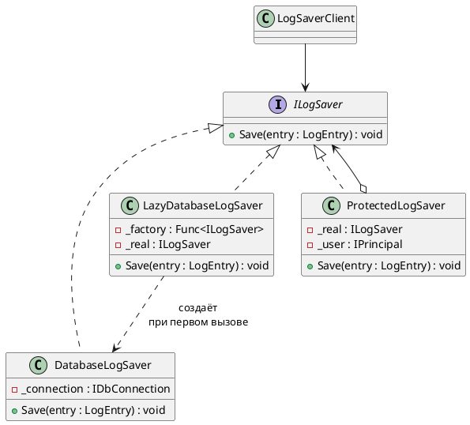
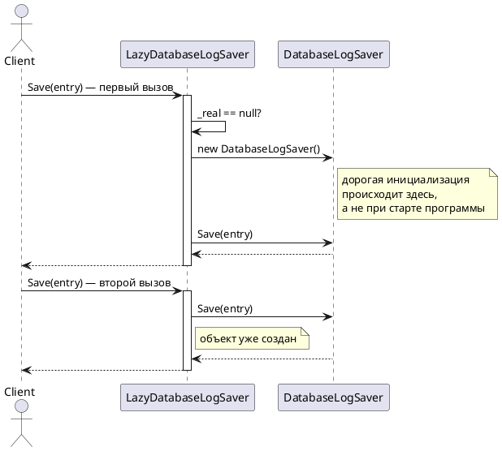

# Proxy (Заместитель)

## Уникальное название

**Proxy (Заместитель)**
Также известен как: *Surrogate*.
Категория: структурный, уровень объекта.

---

## Описание решаемой проблемы

### Проблема

Один из приёмников LogHub пишет в базу данных. Его создание дорогое: открыть
соединение, проверить схему, подготовить команды — секунда-полторы.

При этом:

* приложение открывает соединение при старте, даже если за весь сеанс
  не будет записано ни одной строки;
* соседний сервис читает справочник уровней важности из той же базы —
  одни и те же запросы уходят по сети сотнями раз;
* писать в базу разрешено не всем компонентам, но проверка прав рассыпана
  по вызывающему коду.

Каждую из этих задач можно решить внутри самого `DatabaseLogSaver`:

```csharp
public class DatabaseLogSaver : ILogSaver
{
    private IDbConnection _connection;
    private readonly Dictionary<string, string> _cache = new();

    public void Save(LogEntry entry)
    {
        if (!_currentUser.CanWriteLogs) throw new UnauthorizedAccessException();
        _connection ??= OpenConnection();
        // ... собственно запись
    }
}
```

Класс, который должен уметь одно — записывать в базу, — теперь занимается
ещё правами доступа, ленивой инициализацией и кэшированием. Это нарушение SRP,
и каждая из трёх обязанностей мешает тестировать остальные.
А если `DatabaseLogSaver` — чужой класс, вписать в него ничего и не получится.

### Примеры задач

1. **LogHub.** Отложенное открытие соединения с БД и кэширование справочников (ЛР 5).
2. **Изображения в редакторе.** Документ на сто страниц с картинками:
   грузить нужно только те, что видны на экране. Место в разметке занимает
   лёгкий объект-заместитель.
3. **Вызов удалённой службы.** Клиент работает с локальным объектом,
   заместитель превращает вызов в HTTP-запрос.

---

## Описание способа решения

Создаётся класс, реализующий **тот же интерфейс**, что и настоящий объект.
Клиент работает с ним, не подозревая о подмене. Заместитель решает,
когда и нужно ли вообще обращаться к настоящему объекту.

Ключевая мысль: **заместитель управляет доступом к объекту,
не меняя того, что объект делает.**

### Виды заместителей

| Вид | Что делает | Пример |
|---|---|---|
| **Виртуальный** | Откладывает создание дорогого объекта до первого обращения | Соединение с БД, картинка в документе |
| **Защищающий** | Проверяет права перед вызовом | Запись в лог только для доверенных компонентов |
| **Кэширующий** | Запоминает результат и не вызывает объект повторно | Справочник уровней важности |
| **Удалённый** | Прячет сетевой вызов за локальным интерфейсом | Клиент gRPC или WCF |
| **Умная ссылка** | Считает обращения, освобождает ресурс, ведёт журнал | Подсчёт ссылок, аудит вызовов |

Все они устроены одинаково, различается только то, что заместитель делает
перед делегированием и делегирует ли вообще.

### Участники

| Роль | Класс в примере | Ответственность |
|---|---|---|
| Subject | `ILogSaver` | Общий интерфейс заместителя и настоящего объекта |
| RealSubject | `DatabaseLogSaver` | Настоящая работа |
| Proxy | `LazyDatabaseLogSaver`, `ProtectedLogSaver` | Контроль доступа к RealSubject |
| Client | `LogSaverClient` | Работает через Subject и о подмене не знает |

---

## Диаграмма и способ реализации

### Диаграмма классов



### Диаграмма последовательности



---

## Реализация на C#

### 1. Виртуальный заместитель

```csharp
public class LazyDatabaseLogSaver : ILogSaver
{
    private readonly Func<ILogSaver> _factory;
    private ILogSaver _real;

    public LazyDatabaseLogSaver(Func<ILogSaver> factory) => _factory = factory;

    public void Save(LogEntry entry)
    {
        // Соединение открывается при первой реальной записи.
        // Если записей не будет вовсе — не откроется никогда.
        _real ??= _factory();
        _real.Save(entry);
    }
}
```

В .NET для этого есть готовый тип, и в многопоточном коде лучше брать его:

```csharp
public class LazyDatabaseLogSaver : ILogSaver
{
    private readonly Lazy<ILogSaver> _real;

    public LazyDatabaseLogSaver(Func<ILogSaver> factory) =>
        _real = new Lazy<ILogSaver>(factory);

    public void Save(LogEntry entry) => _real.Value.Save(entry);
}
```

`Lazy<T>` по умолчанию потокобезопасен: при одновременном обращении из нескольких
потоков фабрика выполнится один раз. Самодельная проверка `_real ??= _factory()`
этого не гарантирует — та же ошибка, что и в
[двойной проверке блокировки без `volatile`](../Порождающие/Singleton.md).

### 2. Защищающий заместитель

```csharp
public class ProtectedLogSaver : ILogSaver
{
    private readonly ILogSaver _real;
    private readonly IPrincipal _user;

    public ProtectedLogSaver(ILogSaver real, IPrincipal user)
    {
        _real = real;
        _user = user;
    }

    public void Save(LogEntry entry)
    {
        if (!_user.IsInRole("LogWriter"))
        {
            throw new UnauthorizedAccessException(
                $"Пользователю {_user.Identity?.Name} запрещена запись логов.");
        }

        _real.Save(entry);
    }
}
```

Здесь заместитель может **не вызвать** настоящий объект вовсе —
и это отличает его от декоратора, который всегда делегирует.

### 3. Кэширующий заместитель

```csharp
public class CachingSeverityRepository : ISeverityRepository
{
    private readonly ISeverityRepository _real;
    private readonly ConcurrentDictionary<int, string> _cache = new();

    public CachingSeverityRepository(ISeverityRepository real) => _real = real;

    public string GetName(int code) =>
        _cache.GetOrAdd(code, c => _real.GetName(c));   // к БД — один раз на код
}
```

Кэш обязательно нужно уметь сбрасывать: заместитель, который навсегда запомнил
устаревшее значение, хуже отсутствия кэша. В боевом коде добавляют время жизни
записи или явную инвалидацию.

### 4. Сборка

```csharp
ILogSaver saver = new LazyDatabaseLogSaver(() => new DatabaseLogSaver(connectionString));
saver = new ProtectedLogSaver(saver, currentUser);

new LogSaverClient(saver).SaveAll(entries);
```

Клиент по-прежнему видит `ILogSaver` и не знает ни о ленивости, ни о правах.

### Типичные ошибки

* **Заместитель меняет наблюдаемое поведение.** Если `Save` теперь иногда молча
  ничего не делает, а клиент об этом не знает, — это нарушение LSP.
  Отказ должен быть явным: исключение или возвращаемый признак.
* **Кэш без инвалидации.** Самая частая причина «а у меня старые данные».
* **Ленивость без потокобезопасности.** См. пункт 1.
* **В заместитель добавляется бизнес-логика.** Форматирование, фильтрация,
  обогащение записи — это уже не контроль доступа.

---

## Плюсы и минусы

### Плюсы

* Дорогой объект создаётся только если он действительно понадобился.
* Права, кэширование, журналирование вынесены из класса, который занят своим делом (SRP).
* Клиент ничего не знает о подмене — интерфейс тот же (OCP: заместителя
  можно добавить, не трогая ни клиента, ни настоящий объект).
* Работает и с чужими классами, которые нельзя изменить.
* Настоящий объект остаётся тестируемым отдельно от обвеса.

### Минусы

* Ещё один класс и ещё один уровень косвенности.
* Отложенное создание переносит ошибки инициализации в неожиданное место:
  соединение не откроется не при старте, а посреди работы.
* Заместитель может замедлить ответ на первый вызов — иногда критично.
* Кэш добавляет собственный класс ошибок: устаревшие данные, рост памяти.
* По типу объекта не видно, настоящий он или заместитель, — отладка усложняется.

---

## Области применения

* **В .NET:** `Lazy<T>`; прокси-классы Entity Framework для ленивой загрузки
  навигационных свойств; `RealProxy`/`DispatchProxy` для перехвата вызовов;
  сгенерированные клиенты gRPC и WCF; `IMemoryCache` в связке с репозиторием.
* **Инфраструктура.** Кэширующий слой перед БД, ограничитель частоты запросов,
  circuit breaker перед внешним сервисом.
* **В LogHub:** ленивое соединение с БД и кэш справочников (ЛР 5).

---

## Сравнение с соседними паттернами

| Паттерн | Интерфейс | Зачем | Сколько | Всегда ли делегирует |
|---|---|---|---|---|
| **Заместитель** | Тот же | Контролировать доступ | Обычно один | **Нет** |
| [Декоратор](Decorator.md) | Тот же | Добавить поведение | Несколько, стопкой | Да |
| [Адаптер](Adapter.md) | Другой | Совместить несовместимое | Один | Да |
| [Фасад](Facade.md) | Новый | Упростить подсистему | Один | Да |

Два надёжных признака, отличающих заместителя от декоратора:

1. **Заместитель вправе не вызвать** настоящий объект — декоратор вызывает всегда.
2. **Заместитель часто сам создаёт** подопечного — декоратор получает его готовым.

---

## Когда НЕ применять

* **Когда объект дешёвый.** Ленивость ради объекта, который создаётся за микросекунду, —
  усложнение без выигрыша.
* **Когда нужна ленивость одного поля.** `Lazy<T>` решает задачу без отдельного класса.
* **Когда заместителей выстраивается стопка.** Несколько обёрток подряд —
  это [Декоратор](Decorator.md), и называть их надо так.
* **Когда контроль доступа принадлежит другому слою.** Авторизацию обычно
  делают в middleware или на границе приложения, а не перед каждым вызовом.
* **Когда заместитель начинает менять данные.** Это уже не контроль доступа.

---

## Код

Рабочий пример: [`Implementation/Structural/Proxy/`](../../DesignPatterns/Implementation/Structural/Proxy/)

```bash
dotnet run --project Implementation -- proxy
```

`Proxy.cs` — каноническая схема: `ISubject`, `RealSubject`, `Proxy` с проверкой доступа
и журналированием запроса. Клиент (`Client.ClientCode`) работает и с настоящим объектом,
и с заместителем через один интерфейс и разницы не замечает.

---

## Вывод

Заместитель ставится между клиентом и объектом, чтобы решать, когда, кому
и нужно ли вообще этот объект беспокоить. Сам объект при этом не меняется
и продолжает заниматься своим делом.

Отличать его от декоратора стоит по намерению, а не по коду: декоратор добавляет
поведение и складывается стопкой, заместитель контролирует доступ и обычно один.
Проверочный вопрос — **может ли обёртка не вызвать то, что она обернула.**
Если может, это заместитель.

---

[← Оглавление учебника](../README.md)
