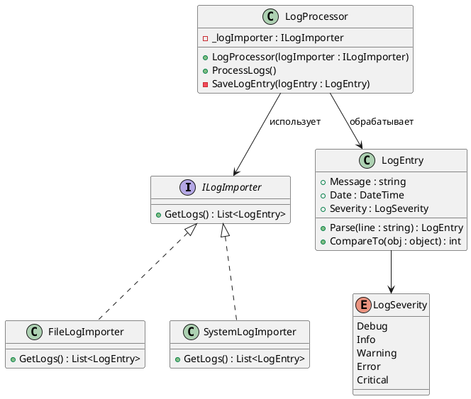
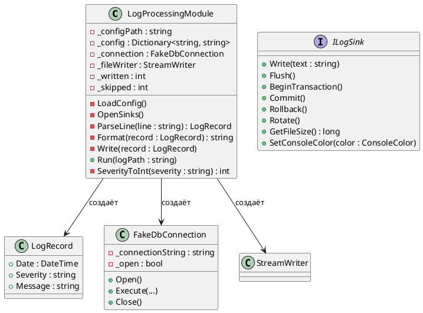
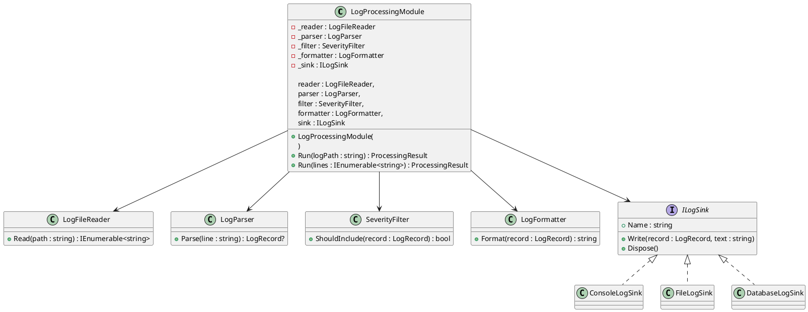

# 📝 Лабораторная работа 1. Git, среда и SOLID

> **Студент:** Кузнецова Елизавета Сергеевна, группа БИСО-01-24  
> **Вариант:** 20 — смешанный поток (два формата вперемешку), приёмники: консоль, файл  
> **Репозиторий:** [Ссылка на GitHub](https://github.com/Allureeee/LogHub-workshop.git)  
> **Pull Request:** [Ссылка на Pull Request](ссылка на Pull Request)

---

## 🎯 Задача

В рамках лабораторной работы необходимо:
* Настроить рабочий процесс проекта **LogHub**.
* Организовать **непрерывную интеграцию (CI)**.
* Изучить структуру незнакомого кода.
* Выполнить рефакторинг **god-класса** с учётом принципов **SOLID**. 

**Ожидаемый результат:** проект с чётко разделёнными ответственностями, возможностью добавления нового приёмника без изменения существующих файлов и тестами, которые не обращаются к внешним ресурсам.

---

## 📊 Диаграмма классов

В качестве примера для чтения чужого кода выбран каталог `Implementation/Behavioral/Strategy`. В нём рассмотрен вариант с `ILogImporter`, `FileLogImporter`, `SystemLogImporter` и `LogProcessor`.



### 🔍 Чтение чужого кода

В выбранном примере реализован паттерн **Стратегия (Strategy)** для выбора способа получения логов. 
* Интерфейс `ILogImporter` определяет общий метод `GetLogs()`.
* Классы `FileLogImporter` и `SystemLogImporter` предоставляют конкретные реализации этого способа получения данных.

Класс `LogProcessor` получает объект `ILogImporter` через конструктор и сохраняет его в поле `_logImporter`. При выполнении метода `ProcessLogs()` процессор вызывает `GetLogs()`, сортирует полученные записи, а затем обрабатывает их по очереди. Таким образом, `LogProcessor` работает с **абстракцией** импортёра и не зависит непосредственно от конкретной реализации.

*Примечание:* В этой же папке находятся `EmployeeByIdComparer` и `EmployeeByNameComparer`, которые задают разные способы сравнения объектов `Employee`. Для диаграммы выбран пример с импортёрами, так как он непосредственно связан с обработкой логов и лучше показывает структуру используемого в примере паттерна.

---

## 🚧 Диаграмма классов ДО рефакторинга

До рефакторинга один класс `LogProcessingModule` выполнял сразу несколько обязанностей (являлся типичным **god-объектом**): загружал конфигурацию, открывал соединения с хранилищами, разбирал строки, фильтровал записи, форматировал их, выбирал приёмник и выполнял запись.



---

## ✨ Диаграмма классов ПОСЛЕ рефакторинга

После рефакторинга обязанности `LogProcessingModule` были чётко разделены между отдельными компонентами. Основной класс теперь **координирует** их работу и больше не содержит логику конкретных приёмников.



---

## 🛑 Нарушения SOLID (до рефакторинга)

| Принцип | Строки | Описание нарушения |
| :--- | :---: | :--- |
| **SRP** (Single Responsibility) | 91–441 | `LogProcessingModule` одновременно отвечает за конфигурацию, работу с БД/файлами, чтение/разбор логов, фильтрацию, форматирование, маршрутизацию и запись. У класса несколько независимых причин для изменения. |
| **OCP** (Open/Closed) | 155–185, 257–281, 297–347, 427–441 | Добавление нового приёмника, формата или уровня важности требует прямого изменения существующих блоков `switch` и методов внутри `LogProcessingModule`. |
| **LSP** (Liskov Substitution) | 457–475 | В исходном файле нет конкретных реализаций `ILogSink`, поэтому прямое нарушение не демонстрируется. Однако потенциальная проблема очевидна: при создании реализаций они не смогут выполнять часть специфичных методов общего интерфейса (например, консоль не умеет делать `Rollback`). |
| **ISP** (Interface Segregation) | 457–475 | Интерфейс `ILogSink` перегружен (запись, транзакции БД, ротация файлов, цвет консоли). Конкретные приёмники вынуждены зависеть от ненужных им методов. |
| **DIP** (Dependency Inversion) | 67–77, 95–137, 161–171, 297–417 | `LogProcessingModule` напрямую зависит от деталей инфраструктуры: файловой системы, `StreamWriter`, `FakeDbConnection` и `Console`. Это делает невозможным тестирование в изоляции. |

---

## 🛠 Рефакторинг god-класса

**Проблема:** До рефакторинга `LogProcessingModule` объединял множество независимых обязанностей. Он самостоятельно читал конфигурацию, парсил строки, фильтровал, форматировал записи и жёстко зависел от конкретных объектов для работы с файлами и базами данных.

**Решение:** Обязанности были строго разделены между специализированными компонентами:
* `ConfigReader` — чтение конфигурации.
* `LogFileReader` — чтение входных данных.
* `LogParser` — разбор строки в объект.
* `SeverityFilter` — фильтрация по уровню важности.
* `LogFormatter` — форматирование вывода.
* **Реализации `ILogSink`** — непосредственная запись.

Теперь `LogProcessingModule` играет роль **координатора**. Он получает нужные зависимости через конструктор (Dependency Injection) и последовательно вызывает их методы. 

Отдельно устранена зависимость от конкретного типа приёмника. Выбор приёмника делегирован фабрике `LogSinkFactory`, а конкретные реализации связаны единым минималистичным контрактом `ILogSink`. Добавление нового приёмника больше не требует вмешательства в ядро программы.

---

## 🧩 Применённые паттерны

| Паттерн | Где применён | Почему именно он |
| :--- | :--- | :--- |
| **Strategy** (Стратегия) | `ILogImporter`, `FileLogImporter`, `SystemLogImporter`, `LogProcessor` | Способ получения логов инкапсулирован в отдельные классы. `LogProcessor` может использовать разные импортёры через общий интерфейс `ILogImporter`, не меняя собственный алгоритм работы. |

---

## 💡 Ключевые решения

1. **Разделение ответственности (SRP):** Выделение этапов обработки (чтение, парсинг, фильтрация, форматирование, запись) в независимые классы. Каждый класс теперь имеет только одну причину для изменения.
2. **Облегчение интерфейсов (ISP):** Интерфейс `ILogSink` был очищен от специфичных методов (транзакции, ротация, цвет). Теперь он содержит только общую операцию записи.
3. **Отказ от `switch` (OCP):** Выбор приёмника через конструкцию `switch` заменён на использование `LogSinkFactory`, которая находит нужную реализацию по атрибуту `SinkName`.

---

## 🧪 Тесты

В проекте реализовано **10 тестов для рефакторинга** и **1 обязательный SmokeTest**.

Тесты покрывают:
* Корректный и некорректный разбор строк.
* Работу фильтра и пропуск некорректных строк.
* Маршрутизацию принятых записей.
* Сохранение исходных счётчиков (записано/пропущено).
* Правильный выбор приёмника и форматирование.

> **Важно:** Все тесты работают с данными в памяти (In-Memory) и полностью изолированы от внешней файловой системы, сети или реальных баз данных.

**Результаты выполнения:**
```text
Сводка теста: всего: 11; сбой: 0; успешно: 11; пропущено: 0
```
*Проверка отдельного теста:*
```text
Сводка теста: всего: 1; сбой: 0; успешно: 1; пропущено: 0
```

Строгая сборка *solution* в конфигурации `Release` завершается успешно и без предупреждений:
```bash
dotnet build .\LogHub.slnx --configuration Release --no-restore -warnaserror
```

---

## ⚠️ Что не получилось (Сложности)

Критических ошибок при выполнении лабораторной работы не возникло. 

Наиболее трудоёмкой задачей оказалось:
1. Аккуратно «разрезать» исходный god-класс, сохранив изначальное поведение программы.
2. Избавиться от прямых зависимостей так, чтобы тесты перестали обращаться к реальной файловой системе. 
3. Обеспечить точное совпадение финальных счётчиков. После рефакторинга для эталонного набора данных корректно сохраняется результат: **Записано: 3, пропущено: 2**.

---

## 📚 Источники

1. Практикум по разделу «Паттерны программирования», Лабораторная работа 4.
2. Учебный репозиторий, каталог `Implementation/Behavioral/Strategy`.
3. Учебный репозиторий, исходный файл `_AntiPatterns/GodObject/LogProcessingModule.cs`.