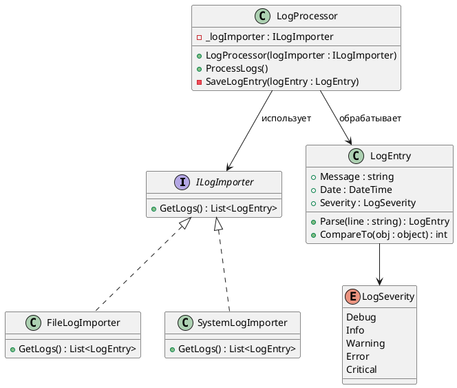

# Лабораторная работа 1. Git, среда и SOLID

**Студент:** Кузнецова Елизавета Сергеевна, группа БИСО-01-24  
**Вариант:** 20 — смешанный поток (два формата вперемешку), приёмники: консоль, файл  
**Репозиторий:** [ссылка на репозиторий](https://github.com/Allureeee/LogHub-workshop.git)  
**Pull Request:** [ссылка на Pull Request](ссылка на Pull Request)

---

## Задача

В рамках лабораторной работы необходимо настроить рабочий процесс проекта LogHub,
проверить сборку и непрерывную интеграцию, а также научиться читать незнакомый код.
На первом этапе был рассмотрен учебный пример паттерна Strategy и построена его
диаграмма классов на PlantUML. В дальнейшем в этой же лабораторной работе выполняется
рефакторинг класса LogProcessingModule с нарушениями SOLID.

---

## Диаграмма классов

### Чтение чужого кода

В выбранном примере из каталога `Implementation/Behavioral/Strategy` реализован
вариант Стратегии для выбора способа получения логов. Интерфейс `ILogImporter`
определяет общий метод `GetLogs()`, а классы `FileLogImporter` и
`SystemLogImporter` предоставляют конкретные реализации этого способа получения
данных.

Класс `LogProcessor` получает объект `ILogImporter` через конструктор и сохраняет
его в поле `_logImporter`. При выполнении `ProcessLogs()` процессор вызывает
`GetLogs()`, сортирует полученные записи, а затем обрабатывает их по очереди.
Таким образом, `LogProcessor` работает с абстракцией импортёра и не зависит
непосредственно от конкретной реализации.

В этой же папке находятся `EmployeeByIdComparer` и `EmployeeByNameComparer`,
которые задают разные способы сравнения объектов `Employee`. Для диаграммы выбран
пример с импортёрами, так как он непосредственно связан с обработкой логов и лучше
показывает структуру используемого в примере паттерна.

---

## Применённые паттерны

| Паттерн | Где применён | Почему именно он |
|---|---|---|
| Strategy | `ILogImporter`, `FileLogImporter`, `SystemLogImporter`, `LogProcessor` | Способ получения логов вынесен в отдельную реализацию, поэтому `LogProcessor` может использовать разные импортёры через общий интерфейс без изменения собственного алгоритма обработки. |

---

## Ключевые решения

Для чтения чужого кода выбран пример с `ILogImporter`, поскольку он непосредственно
связан с логами и содержит понятное разделение между общим интерфейсом и конкретными
реализациями. Диаграмма показывает только классы и связи, необходимые для понимания
этого фрагмента кода, без добавления несвязанных элементов из других примеров.

---

## Тесты

Раздел будет дополнен после выполнения рефакторинга `LogProcessingModule` и создания
обязательных тестов. По заданию должно быть не менее 6 тестов, проверяющих разбор
строки лога и маршрутизацию, при этом тесты не должны обращаться к диску, сети или
базе данных.

---

## Что не получилось

На этапе чтения чужого кода существенных проблем не возникло. Основной сложностью
было определить, какие классы относятся непосредственно к рассматриваемой части
примера и какие связи необходимо показать на диаграмме. Диаграмма была проверена
в PlantUML и соответствует рассмотренному исходному коду.

---

## Источники

1. Учебный репозиторий преподавателя, каталог `Implementation/Behavioral/Strategy`.
2. Практикум по разделу «Паттерны программирования».
