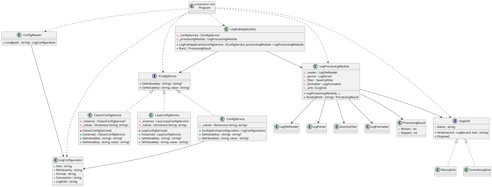

# 📝 Лабораторная работа 2. IoC, DI-контейнер и Синглтон

> **Студент:** Кузнецова Елизавета Сергеевна, группа БИСО-01-24  
>
> **Вариант:** 20 — смешанный поток (два формата вперемешку), приёмники: консоль, файл  
>
> **Репозиторий:** [Ссылка на GitHub](https://github.com/Allureeee/LogHub-workshop)  
> **Pull Request:** [ЛР2: IoC, DI-контейнер и Синглтон - #3]()

---

## 🎯 Задача

В работе требовалось реализовать сервис конфигурации тремя способами:
* Классическим **Singleton**;
* Singleton через `Lazy<T>`;
* Обычным классом. 

Затем нужно было на тестах воспроизвести проблему переноса состояния между тестами, собрать LogHub через `Microsoft.Extensions.DependencyInjection` и реализовать переключение приёмника через конфигурацию без перекомпиляции.

Для **варианта 20** также был доработан сквозной парсер LogHub: входной поток содержит два формата записей вперемешку — *pipe-формат* и *JSON Lines*, а формат определяется автоматически.

---

## 📊 Диаграмма классов



---

## 🧩 Применённые паттерны

| Паттерн | Где применён | Почему именно он |
|---|---|---|
| **Singleton** | `ClassicConfigService` и `LazyConfigService` | Эти реализации нужны для сравнения единственного экземпляра и глобальной точки доступа. На классическом варианте показано, как общее состояние переносится между тестами. Вариант через `Lazy<T>` позволяет получить единственый экземпляр без ручного управления его созданием. |
| **Dependency Injection** | `LogHubApplication`, `LogProcessingModule`, `ConfigService`, `ILogSink` | Зависимости передаются через конструкторы, поэтому прикладные классы не создают их самостоятельно и не обращаются к глобальной точке доступа. Это позволяет заменять реализации в *composition root*. |
| **IoC-контейнер** | `Program` с `Microsoft.Extensions.DependencyInjection` | Контейнер управляет созданием и временем жизни зарегистрированных сервисов. Выбор `ConsoleLogSink` или `FileLogSink` задаётся в *composition root* по конфигурации, без Service Locator в бизнес-коде. |

---

## 💡 Ключевые решения

1. **Выбор реализации для DI:** Для DI выбран обычный `ConfigService`, а не классический Singleton. Он имеет публичный конструктор и может создаваться контейнером, поэтому состояние сервиса определяется конкретным экземпляром контейнера, а не статическим полем класса.
2. **Организация Composition Root:** Композиционный корень расположен в `Program.cs`. Там выполняются чтение конфигурации, регистрация зависимостей и создание контейнера. Обращение к `IServiceProvider` выполняется *только* в точке входа при получении `LogHubApplication`; в прикладном коде `GetService` и `GetRequiredService` не используются.
3. **Обработка смешанного потока:** Для варианта 20 сохранён существующий pipe-формат и добавлен JSON Lines. `LogParser` определяет формат по содержимому строки: строки, начинающиеся с `{`, разбираются как JSON, остальные — как pipe-формат. Поэтому один входной файл может содержать оба формата вперемешку.

### ⚖️ Singleton и AddSingleton

* 🏛️ **Классический `Singleton`**
  Хранит единственный экземпляр в статическом поле и предоставляет глобальную точку доступа через метод `Instance()`. Поэтому состояние объекта сохраняется между вызовами и может переноситься между тестами.
  
  > 🧪 **Подтверждение в тестах:** В проекте проблема классического Singleton подтверждена тестами [ClassicConfigServiceTests](../LogHub/LogHub.Tests/Configuration/ConfigServiceTests.cs). Каждый тест по отдельности проходил успешно, а совместный запуск приводил к падению из-за наличия общего состояния.

* 📦 **`AddSingleton` (в DI-контейнере)**
  Не требует статического экземпляра и метода `Instance()`. Контейнер создаёт один экземпляр зарегистрированного сервиса в пределах своего времени жизни, а сам прикладной код получает зависимость через конструктор.
  
  > 🧪 **Подтверждение в тестах:** Для обычного `ConfigService` тест [DifferentInstances_ShouldHaveIndependentState](../LogHub/LogHub.Tests/Configuration/ConfigServiceTests.cs) показывает независимость состояния отдельных экземпляров. Поэтому при использовании DI нет необходимости сбрасывать статическое состояние между тестами.

---

## 🧪 Тесты

В результате выполнения ЛР2 в проекте находится **18 тестов**:

```text
$ dotnet test
Всего: 18
Сбой: 0
Успешно: 17
Пропущено: 1
```

Проблема классического Singleton была воспроизведена до добавления атрибута `[Ignore]`. Тесты `A_ShouldStartWithEmptyState` и `B_ShouldStartWithEmptyState` по отдельности проходили успешно, а совместный запуск `ClassicConfigServiceTests` давал:

```text
Всего: 2
Сбой: 1
Успешно: 1
```

> **Причина:** Сохранение значения в одном статическом экземпляре `ClassicConfigService` между тестами.

После демонстрации проблемы тест был помечен:

```csharp
[Ignore("Демонстрация переноса состояния между тестами из-за глобального состояния классического Singleton")]
```

* Тест `DifferentInstances_ShouldHaveIndependentState` проверяет независимость состояния двух экземпляров обычного `ConfigService`. 
* Тест `Instance_ShouldReturnSameObject` проверяет получение одного экземпляра `LazyConfigService`.
* Для **варианта 20** добавлены тесты разбора *JSON Lines*, смешанного потока и некорректного JSON.

---

## ⚠️ Что не получилось (Сложности)

* **Параллельное выполнение тестов:** Первая версия теста Singleton не воспроизводила ошибку при совместном запуске, потому что *MSTest* выполнял методы параллельно. После изменения сценария тестов и отключения параллельного выполнения для демонстрационного класса удалось получить требуемую зависимость от общего состояния.
* **Расширение парсера:** Дополнительно для варианта 20 потребовалось расширить `LogParser`, не изменяя поддерживаемый ранее pipe-формат. После доработки оба формата успешно обрабатываются вперемешку.

---

## 📚 Источники

1. `Практикум/ЛР2_IoC_DI_Синглтон.md` — задание и требования лабораторной работы.
2. `Практикум/README.md` — вариант 20, правила сдачи и общий чеклист.
3. `Microsoft.Extensions.DependencyInjection` — использованный пакет DI-контейнера.

---

[← К списку работ](../Практикум/README.md)